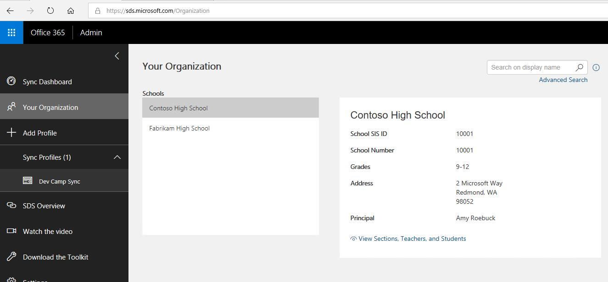
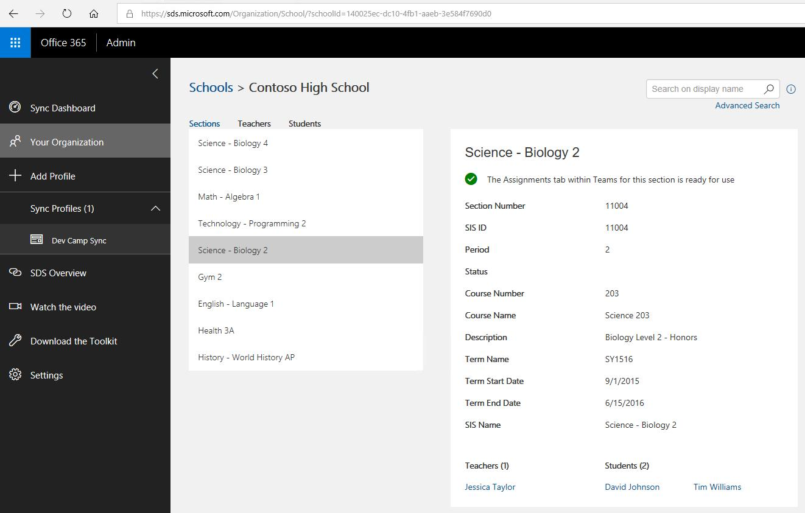
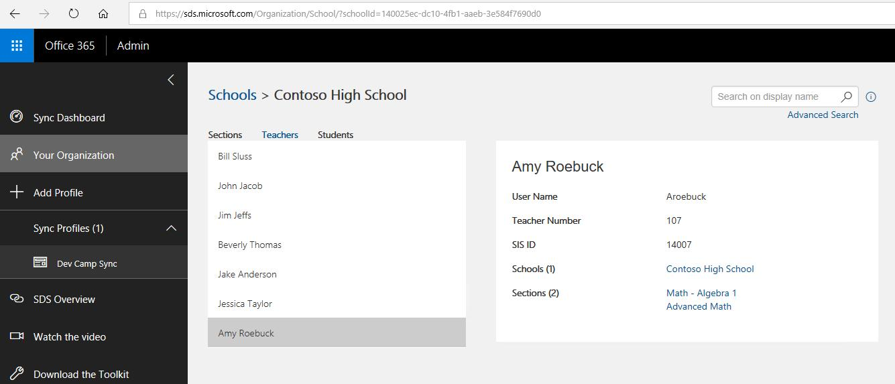
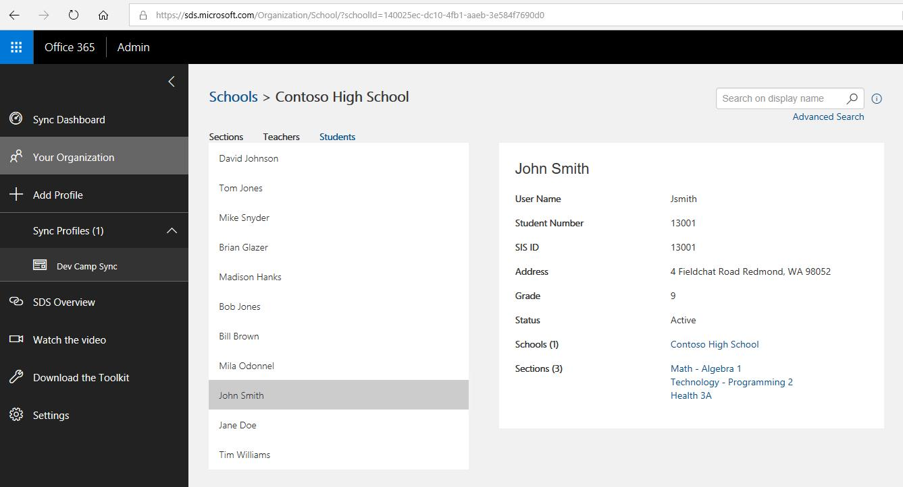
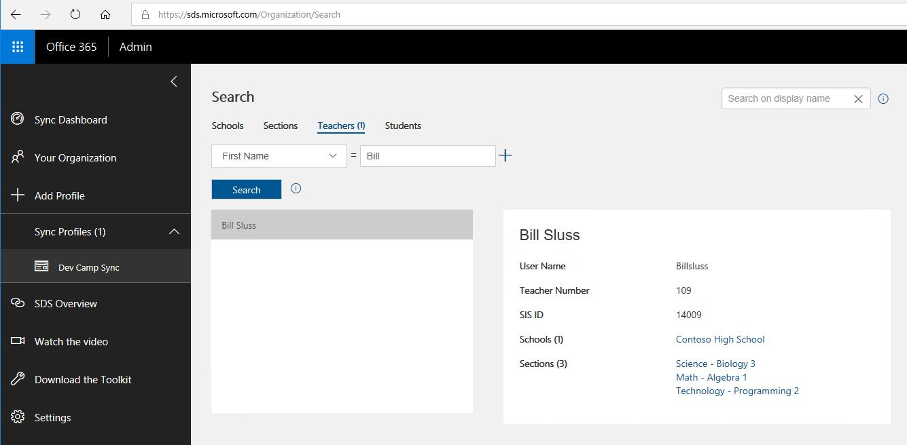

# Explore School Data Sync data

## Overview
In this lab, you will explore your School Data Sync demo data using web interfaces. You will learn about the Graph API which you can use to create applications that utilize the API to read and modify the data.

**This lab is a requirement for the other hands-on labs.**

## Prerequisites

Complete HOL 0 to set up demo data in the School Data Sync Admin Portal.

## Exercises
This hands-on-lab has the following exercises:
* [Exercise 1: Using SDS portal](#ex1)
* [Exercise 2: Using Graph Explorer](#ex2)
---

## Exercise 1: Using SDS portal

In the previous hands-on-lab you created a sync to upload sample data to your School Data Sync Admin Portal. The portal lets you browse and query the synced data.

1. To access the School Data Sync Admin Portal launch a private web browser, navigate to [sds.microsoft.com](https://sds.microsoft.com), click `Sign-In`, then enter your O365 Global Admin account credentials.

1. After logging in, click `Your Organization` in the left hand navigation pane to see a list of your schools.

    

1. After selecting a school, click `View Sections, Teachers, and Students` below the school details to reach the sections overview.

    

1. Click `Teachers` to see the list of teachers. Select a teacher to see details.

    

1. Click `Students` to see the list of teachers. Select a teacher to see details.

    

1. Click `Advanced Search` to see created queries on your data. You can combine multiple criteria to filter your data.

    

---
## Exercise 2: Using Graph Explorer

When you want to utilize your data within your own applications you use the Microsoft Graph API. Microsoft provides the online Graph Explorer so you can test the queries to the API before you implement them in your application.

1. You have to wait for the permissions to update before you can access user data.

---
## Continue with lab 2

You are now ready to start hands-on lab 2. [View HOL 2 instructions](../HOL2).

---
Copyright 2018 Microsoft Corporation. All rights reserved. Except where otherwise noted, these materials are licensed under the terms of the MIT License. You may use them according to the license as is most appropriate for your project. The terms of this license can be found at https://opensource.org/licenses/MIT.