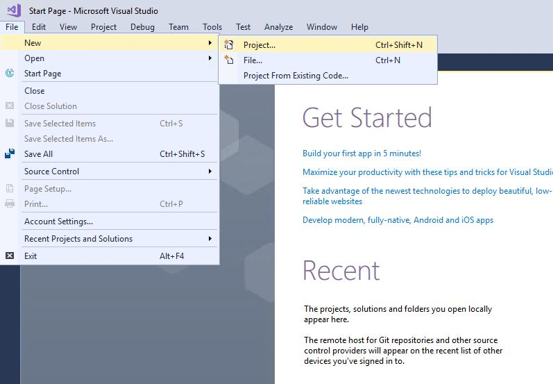
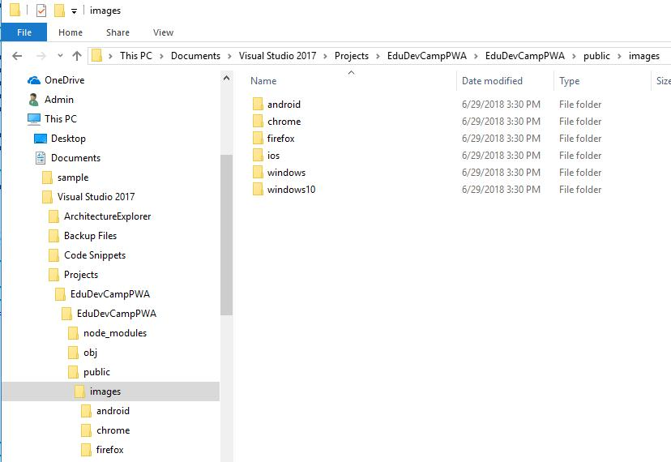
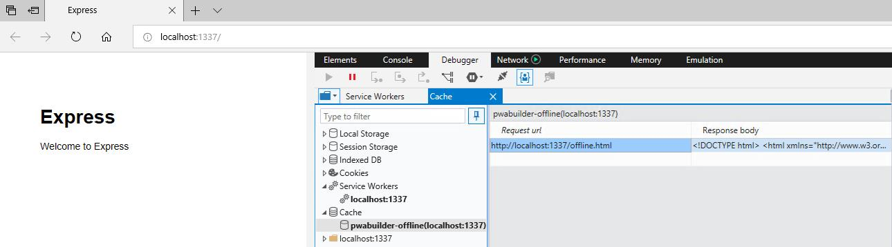
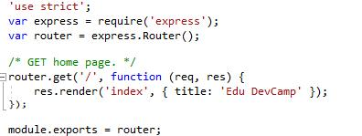
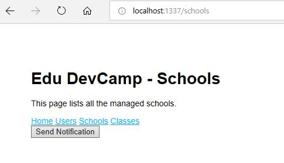

# Progressive Web Apps

## Content<a name="content"></a>
* [Overview](#overview)
* [Prerequisites](#prerequisites)
* [Exercise 1: Create a Progressive Web App](#ex1)
    * [Set up a basic web app](#ex1a)
    * [Web App Manifest](#ex1b)
    * [HTTPS](#ex1c)
    * [Service Workers](#ex1d)
* [Exercise 2: Customize the PWA](#ex2)
* [Download the finished PWA solution](#download)
* [Continue with lab 3](#continue)

---

## Overview<a name="overview"></a>

Intro...

**This lab is a requirement for the other hands-on labs!**

[Back to top](#content)

---

## Prerequisites<a name="prerequisites"></a>


* Complete [HOL 0](./../HOL0) to create a development image with Visual Studio 2017.

[Back to top](#content)

---

## Exercise 1: Create a Progressive Web App<a name="ex1"></a>

### Set up a basic web app<a name="ex1a"></a>

For the sake of simplicity, we'll use the `Visual Studio Node.js and Express app` template to create a basic, localhost web app that serves up an `index.html` page. Imagine this as a placeholder for the compelling, full-featured web app you'll be developing as a PWA.

1. If you don't have `Node.js` installed, install the LTS version from the [Node.js](https://nodejs.org/en/download/) website. Download the 64 Bit MSI version and run the setup. Follow the wizard to complete the installation. In general, Visual Studio automatically detects the installed `Node.js` runtime. If it does not detect an installed runtime, you can configure your project to reference the installed runtime in the properties page (after you create a project, right-click the project node and choose `Properties`).

    If you are not allowed to download files in the freshly deployed development virtual machine follow these instructions:

    1. Open Internet Explorer.
    1. From the `Tools` menu, select `Internet Options`.
    1. In the `Internet Options` dialog box, click the `Security` tab.
    1. Click `Custom Level`.
    1. In the `Security Settings` dialog box, scroll to the `Downloads` section.
    1. Under `File download`, select `Enable`, and then click `OK`.
    1. In the confirmation dialog box, click `Yes`.

1. Launch Visual Studio, and start a new project (`File` > `New` > `Project...` or press `Ctrl + Shift + N`).

    

1. Under `JavaScript`, select `Basic Node.js Express 4 Application`. Set the name to `EduDevCampPWA` and click `OK`.

    

1. Once your new project loads, Build (press `Ctrl + Shift + B`) and Start Debugging (`F5`). Verify that your `index.html` file is loading on [http://localhost:1337](http://localhost:1337).

    

Now its time to wire up the basic [PWA requirements](https://docs.microsoft.com/en-us/microsoft-edge/progressive-web-apps#requirements) for your web app: a Web App Manifest, HTTPS and Service Workers.

### Web App Manifest<a name="ex1b"></a>

A [Web App Manifest](https://developer.mozilla.org/en-US/docs/Web/Manifest) is a JSON metadata file describing your app, including its name, author, entry page URL, and icon(s). Because it follows a standards-based schema, you need only supply a single web app manifest for your PWA to be installable on any platform / OS / device that supports PWAs. In the Windows ecosystem, your web app manifest signals to the Bing web indexer that your PWA is a candidate for [automatic inclusion in the Microsoft Store](https://docs.microsoft.com/en-us/microsoft-edge/progressive-web-apps/microsoft-store), where it can reach nearly 700 million active monthly users as a Windows 10 app.

If this were an existing live site, you could quickly generate a web app manifest using PWA Builder. Since its still an unpublished project, we'll copy in a sample manifest.

1. In the Visual Studio Solution Explorer, right-click the public folder and select `Add` > `New File...`, specifying `manifest.json` as the item name.

    

1. In the `manifest.json` file, copy in the following boilerplate:

    ```json
    {
        "dir": "ltr",
        "lang": "en-us",
        "name": "Edu Dev Camp PWA",
        "scope": "/",
        "display": "browser",
        "start_url": "https://PLACEHOLDER-FOR-PWA-URL",
        "short_name": "EduDevCampPWA",
        "theme_color": "transparent",
        "description": "A sample PWA for the Edu Dev Camp",
        "orientation": "any",
        "background_color": "transparent",
        "related_applications": [],
        "prefer_related_applications": false,
        "icons": []
    }
    ```

    If this were a real PWA, you'd obviously want to customize at least the `name`, `start_url`, `short_name`, and `description`, as well as the `icons`.

    See the [Web App Manifest](https://developer.mozilla.org/en-US/docs/Web/Manifest) reference on MDN web docs to learn more about the different member values and their purpose.

1. Next, let's fill in the empty icons array with actual image paths. For that, we'll use PWA Builder's App Image Generator.

    1. Using a web browser, download [this sample PWA image set](./assets/AppImages.zip). If you have downloaded the Dev Camp content you can find the `AppImages.zip` file in the folder `HOL/HOL1/assets/`. You can create your own images and using tools like the [PWA Builder's App Image Generator](https://www.pwabuilder.com/imageGenerator) easily resize them for all applications.
    
    1. Open and Extract the zip file.

        

    1. In the Visual Studio Solution Explorer, right-click the `public` folder and `Open Folder in File Explorer`. Create a New folder named `images`.

        

    1. Copy all of the platform folders (`android`, `chrome`, ..., `windows10`) from your extracted zip to the images folder and close the file explorer window. Add these folders to your Visual Studio project (in `Solution Explorer`, right-click `images` folder and select `Add` > `Existing folder...` for each of the folders.)

        

        

    1. Open (with Visual Studio or any editor) the `icons.json` file from the extracted zip and copy the `"icons": [...]` array into your project's `manifest.json` file.

        

1. Now we just need to associate our web app manifest with the app itself. Open the `layout.pug` file in `views` folder for editing, and add this line right after the stylesheet link. (Its simply Node's pug template shorthand for `<link rel='manifest' href='/manifest.json'>`).

    ```json
    link(rel='manifest', href='/manifest.json')
    ```

    

    With all that in place, your web app is now serving up a manifest and homescreen-ready app icons! Try running your app (F5) and loading up the [manifest](http://localhost:1337/images/windows10/SplashScreen.scale-400.png):

    

    And one of your [icons](http://localhost:1337/manifest.json):

    

If you publish the app live (with an actual `start_url`), the Bing search engine could now identify it as a candidate for automatic packaging and submission to the Microsoft Store as an installable Windows 10 app. Just make sure that your manifest includes the quality signals for Progressive Web Apps that Bing will be scanning for: `name`, `description`, at least one icon 512px square or larger (to ensure an image source of sufficient resolution for auto-generating you app's splash screen, store listing, tile image, etc.) in addition to being HTTPS, using service workers, complying with [Microsoft Store Policies](https://docs.microsoft.com/en-us/legal/windows/agreements/store-policies).

### HTTPS<a name="ex1c"></a>

Service Workers and other key PWA technologies that work with service workers (such as the Cache, Push, and Background Sync APIs) only work across secure connections, which means HTTPS for live sites or localhost for debugging purposes.

If you were to publish this web app as a live site, you'll want to ensure your server is configured for HTTPS. We will be using the Microsoft Azure App Service to host your site later and it will will be served over HTTPS by default.

For this moment we'll continue using http://localhost as a placeholder for a live site served over https://.

### Service Workers<a name="ex1d"></a>

Service Workers is the key technology behind PWAs. They act as a proxy between your PWA and the network, enabling your website to act as an installed native app: serving up offline scenarios, responding to server push notifications, and running background tasks. Service workers also open up all kinds of new performance strategies; and website need not even be full-blown web app to take advantage of the service worker cache for fine-tuned page load performance.

Service workers are event-driven background threads that run from JavaScript files served up alongside the regular scripts that power your web app. Because they don't run on the main UI thread, service workers don't have DOM access, though the UI thread and a worker thread can communicate using `postMessage()` and `onmessage` event handlers.

You associate a service worker with your app by registering it to your site's URL origin (or a specified path within it). Once registered, the service worker file is then downloaded, installed, and activated on the client machine.

For this tutorial, we'll use a ready-made "Offline page" service worker script courtesy of [PWA Builder](https://www.pwabuilder.com/serviceworker). From this, you can go on to customize it with more elaborate functionality according to your needs for performance, network bandwidth, etc. Check out Mozilla's [Service Worker Cookbook](https://serviceworke.rs/) for a number of useful service worker caching "recipe" ideas.

1. Download these two JavaScript files: [pwabuilder-sw.js](./assets/pwabuilder-sw.js) and [pwabuilder-sw-register.js](./assets/pwabuilder-sw-register.js). If you have downloaded the Dev Camp content you can find the `.js` files in the folder `HOL/HOL1/assets/`.

1. Place them in the public folder of your Visual Studio web app project. (From Visual Studio, use `Ctrl + O` to open file explorer to your project and navigate to the public folder).

    

    

    Its worth reviewing the code in both of these files, to get the gist of how to register a service worker that caches a designated page (`offline.html`) and serves it when a network fetch fails. Next, we need to create a simple `offline.html` page as a placeholder for our app's offline functionality.

1. In Solution Explorer, open the `views/layout.pug` file, and add the following line below your link tags:

    ```html
    script(src='/pwabuilder-sw-register.js')
    ```

    

    So that your site will load and run your service worker registration script.

1. In Solution Explorer, right-click on the public folder and select `Add` > `New File...`. Name it `offline.html`, and add this content:

    ```html
    <!DOCTYPE html>
    
    <html xmlns="http://www.w3.org/1999/xhtml">
    <head>
        <meta charset="utf-8" />
        <title>Offline mode</title>
    </head>
    <body>
        You are now offline.
    </body>
    </html>
    ```

    At this point, your public folder should have three new files:

    

1. In Solution Explorer, open the `routes\index.js` file, and add the following code just before the final command (module.exports = router;):

    ```javascript
    router.get('/offline.html', function (req, res) {
        res.sendFile('public/offline.html');
    });
    ```

    This instructs your app to serve the `offline.html` file (when your service worker fetches it for the offline cache).

1. Let's test out your PWA! Build (`Ctrl + Shift + B`) and Run (`F5`) your web app to launch Microsoft Edge and open your localhost page.

    1. Then, open the Edge DevTools Console (`Ctrl + Shift + J`) and verify the Service worker was registered.

    1. In the `Debugger` panel, expand the `Service Workers` control and click on your origin. In the `Service Worker Overview`, verify your service worker is activated and running:

        

    1. Still in the `Debugger`, expand the `Cache` control and verify that the `offline.html` page has been cached.

        

1. Time to try your PWA as an offline app! In Visual Studio, Stop debugging (`Shift + F5`) your web app, then open Microsoft Edge (or reload) to your website's localhost address. It should now load the `offline.html` page (thanks to your service worker and offline cache).

    

    If you encounter the error Unable to get property 'controller' of undefined or null reference your Edge version is too old.

[Back to top](#content)

---
## Exercise 2: Customize the PWA<a name="ex2"></a>

You will add some additional placeholder pages and a simple nav bar to the PWA that will be used in later hands-on-labs.

1. Change the title to `Edu DevCamp`. Open the `routes` -> `index.js` file and change the `title` attribute from `Express` to `Edu DevCamp`.

    

1. Add the two additional pages `schools` and `classes` to the web app. In the Solution Explorer right click on `views` and select `Add` -> `New File...`. Name the file `schools.pug`. Repeat the process and create `classes.pug`.

    

1. Open `schools.pug` and insert this content:

    ```javascript
    extends layout
    
    block content
      h1= title
      p This page lists all the managed schools.
    ```

1. Open `classes.pug` and insert this content:

    ```javascript
    extends layout
    
    block content
      h1= title
      p This page lists all the managed classes.
    ```

1. In the Solution Explorer right click on `routes` and select `Add` -> `New File...`. Name the file `schools.js`. Repeat the process and create `classes.js`.

1. Open `schools.js` and insert this content:

    ```javascript
    'use strict';
    var express = require('express');
    var router = express.Router();
    
    /* GET schools page. */
    router.get('/', function (req, res) {
        res.render('schools', { title: 'Edu DevCamp - Schools' });
    });
    
    module.exports = router;
    ```

1. Open `classes.js` and insert this content:

    ```javascript
    'use strict';
    var express = require('express');
    var router = express.Router();
    
    /* GET classes page. */
    router.get('/', function (req, res) {
      res.render('classes', { title: 'Edu DevCamp - Classes' });
    });
    
    module.exports = router;
    ```

1. To make the two new pages available, open `app.js` and add:

    ```javascript
    var schools = require('./routes/schools');
    var classes = require('./routes/classes');
    ```

    below:

    ```javascript
    var users = require('./routes/users');
    ```

    Also add:

    ```javascript
    app.use('/schools', schools);
    app.use('/classes', classes);
    ```

    below:

    ```javascript
    app.use('/users', users);
    ```

1. Create a nav bar to reach the new pages by adding the following code to the end of `views` -> `layout.pug`:

    ```javascript
        a(href='/') Home
        |
        |
        a(href='/users') Users
        |
        |
        a(href='/schools') Schools
        |
        |
        a(href='/classes') Classes
        br
    ```

1. Build (press `Ctrl + Shift + B`) and Start Debugging (`F5`). When you open [http://localhost:1337](http://localhost:1337) you should see your new nav bar in your re-branded PWA and should be able to navigate to the two new pages you have created.

    

[Back to top](#content)

---

## Download the finished PWA solution<a name="download"></a>

If you want to skip this hands-on-lab or if you run into any problems you can download the finished solution from the [PWA](./PWA) folder. To start debugging you have to right-click the `npm` node in the Solution Explorer and select `Update npm Packages` first.


[Back to top](#content)

---

## Continue with lab 3<a name="continue"></a>

You are now ready to start hands-on lab 3. [View HOL 3 instructions](../HOL3).

[Back to top](#content)

---

Copyright 2018 Microsoft Corporation. All rights reserved. Except where otherwise noted, these materials are licensed under the terms of the MIT License. You may use them according to the license as is most appropriate for your project. The terms of this license can be found at https://opensource.org/licenses/MIT.