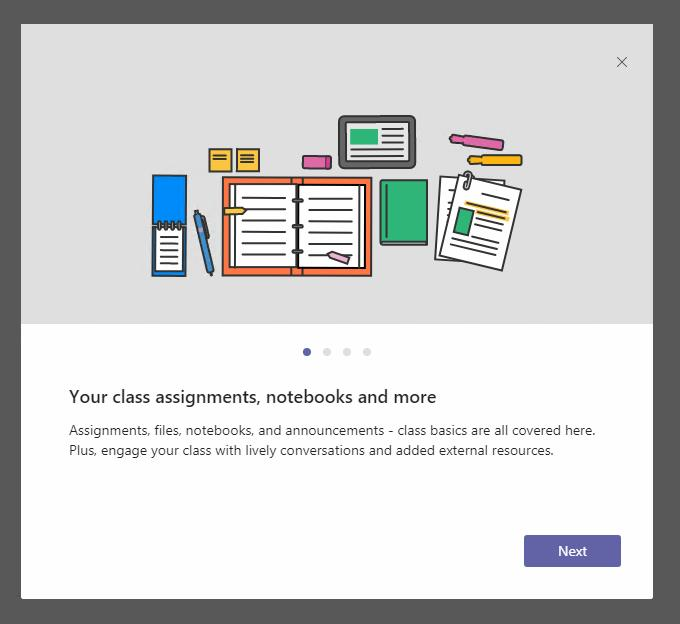
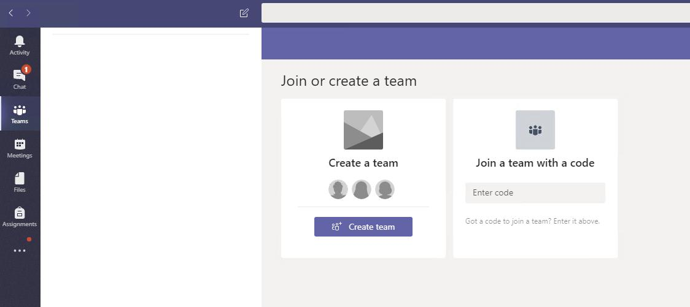
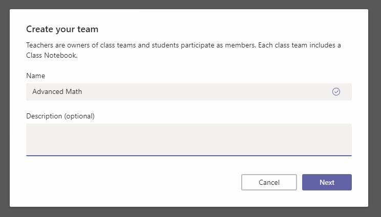
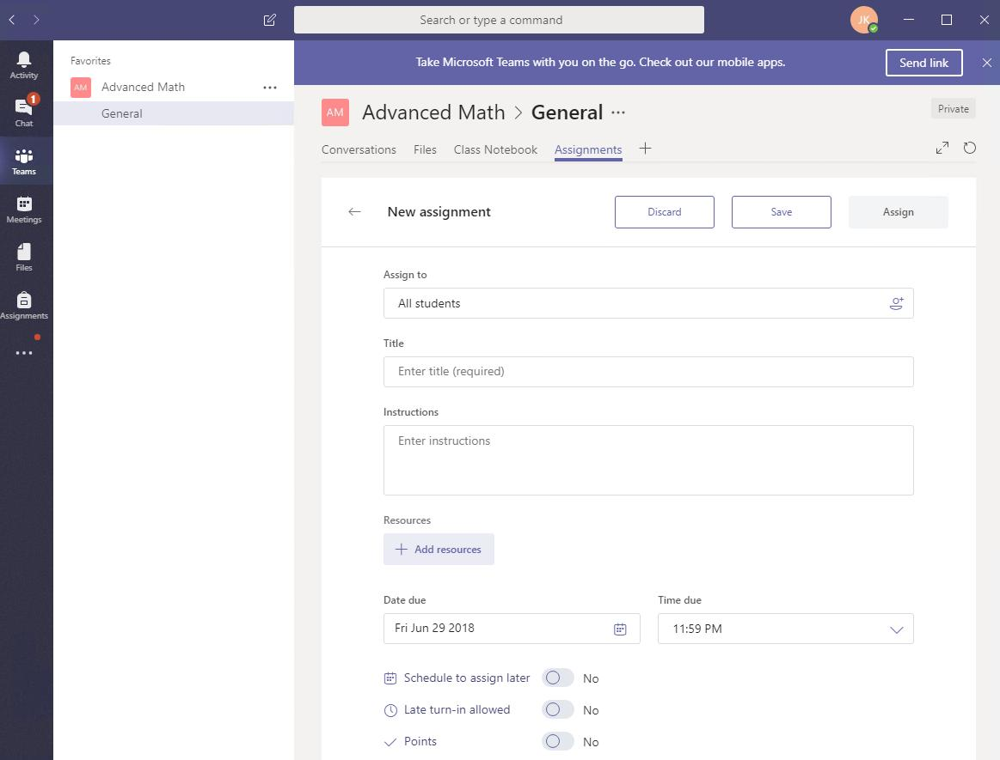
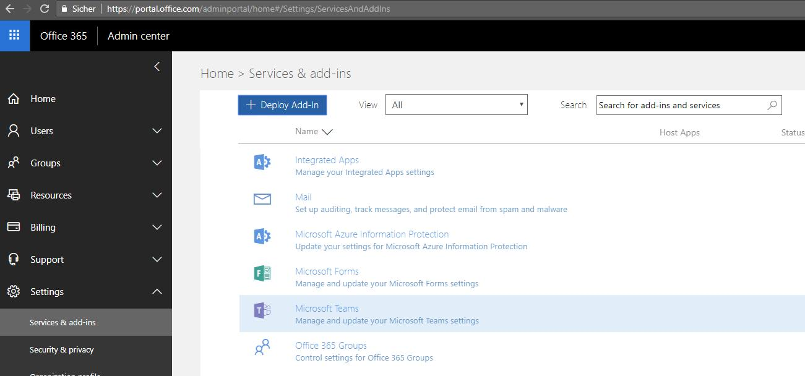
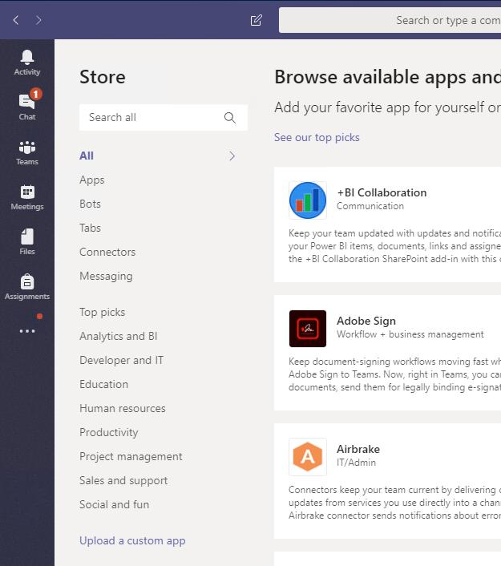
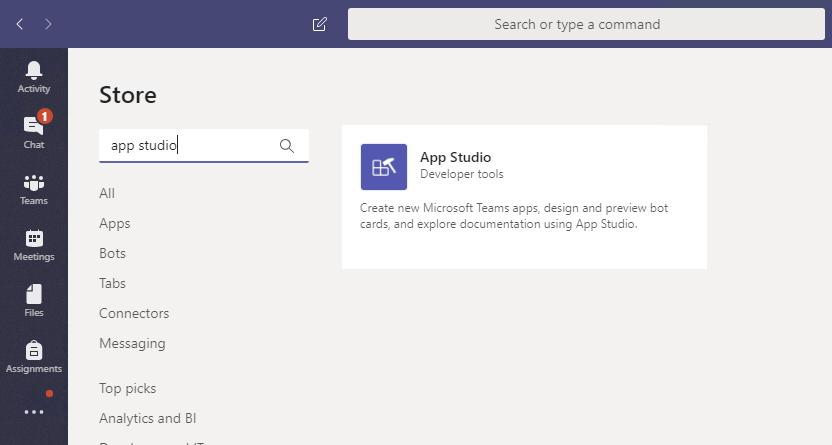
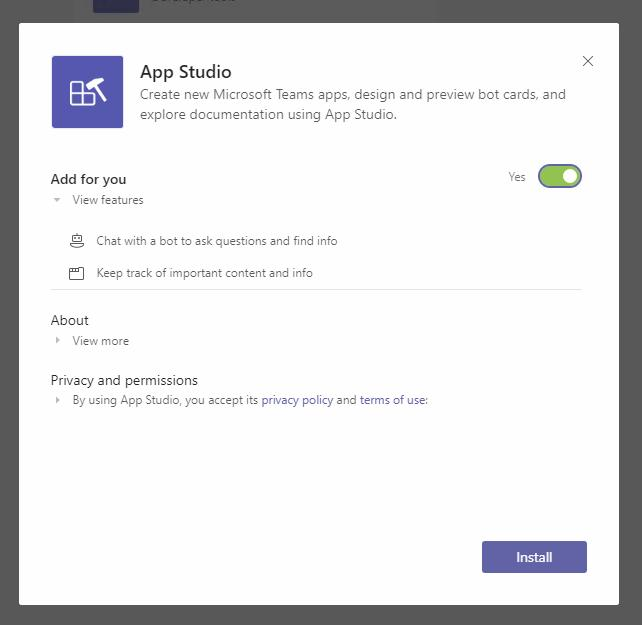
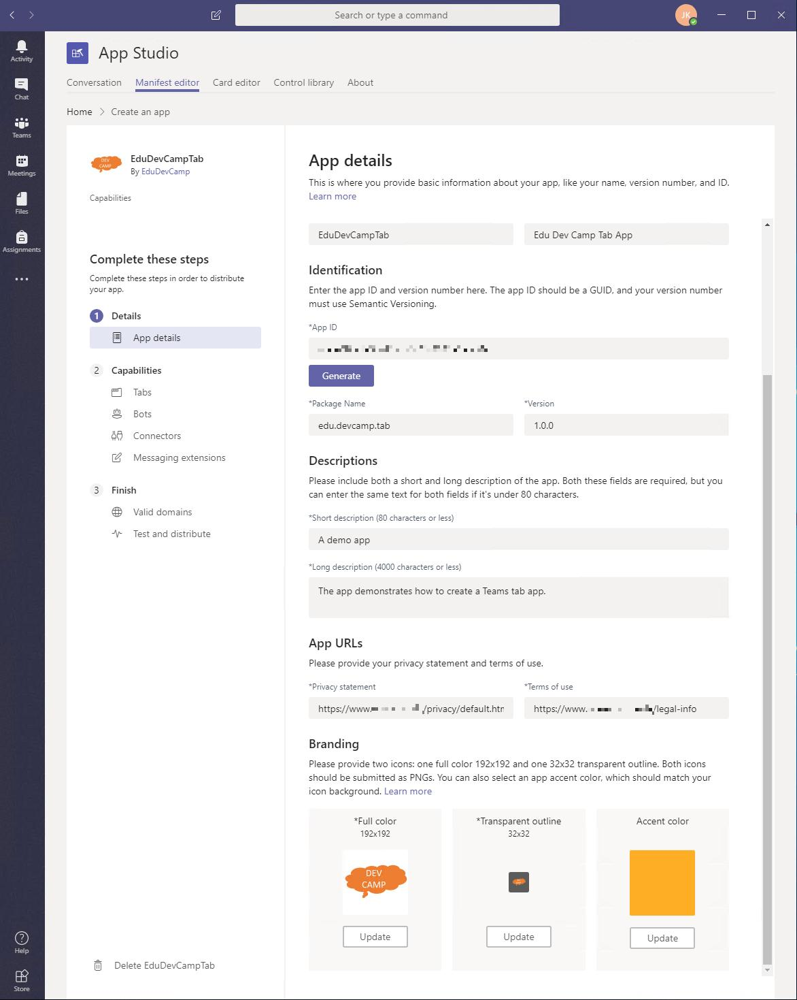
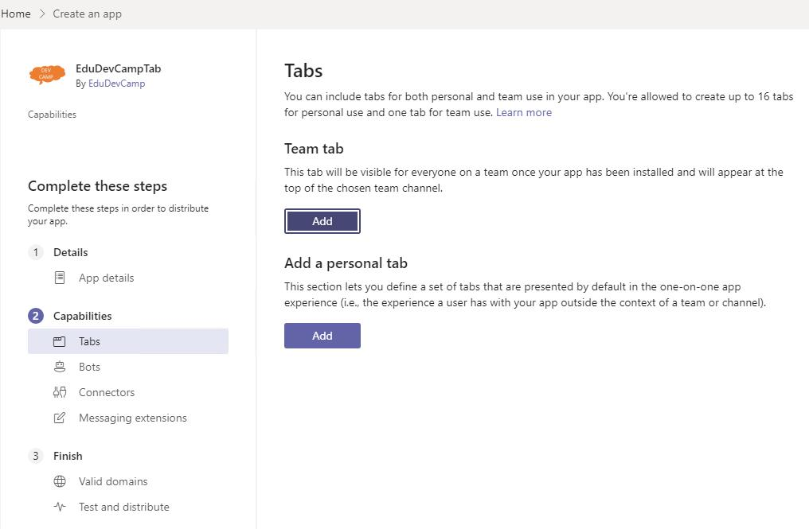

# Microsoft Teams

## Overview
In this lab, you will set up Microsoft Teams on your system, create your first team and create a custom Teams app hosted in Microsoft Azure.

## Prerequisites

Complete [HOL 0](./../HOL0) to set up demo data in the School Data Sync Admin Portal.

## Exercises
This hands-on-lab has the following exercises:
* [Exercise 1: Set up Microsoft Teams](#ex1)
* [Exercise 2: Create a new team](#ex2)
* [Exercise 3: Create a Teams app](#ex3)
---

## Exercise 1: Set up Microsoft Teams

1. Open a InPrivate or Incognito browser window (`Ctrl + Shift + P` in Edge and Internet Explorer and Firefox or `Ctrl + Shift + N` in Google Chrome)
 and browse to [teams.microsoft.com](https://teams.microsoft.com/). Click `Downloads` and select `Desktop (Windows 7+)` and click `DOWNLOAD NOW (64-BIT)`.

    

1. Execute the downloaded installer and when prompted login with your O365 Global Admin account credentials.

    

1. After the installation finished, complete the welcome wizard.

    

---
## Exercise 2: Create a new team

### Create a team

1. On the menu on the left click `Teams` and then click the `Create team` button in the center.

    

1. Select `Classes` as the team type.

    

1. Enter a `Name` for your team.

    

1. Find some students by entering a letter in the search box and add them to your team by clicking the names and clicking `Add`.

    

### Create a Class Notebook

1. Click `Set up Class Notebook`.

    

1. Follow the wizard by clicking `Next`.

    

1. Keep all the preselected features and click `Create`.

    

1. Wait for the wizard to finish.

    

### Create an Assignment

1. Go to the team's `Assignment` tab and click `Create` and `+ New assignment`.

    

1. Enter all required fields and click `Save`.

    

1. The assignment has been added to your list of assignments.You can edit it by clicking it.

    

You have manually created an assignment for your class. In a later hands-on-lab you will create assignments automatically.

---
## Exercise 3: Create a Teams app

### Write your app

1. ...

### Host your app in Azure

1. Open Azure Cloud Shell

1. Create a resource group

1. Create an Azure App Service plan

1. Create a web app

1. Deploy ZIP file

1. Browse to the app

### Allow external apps in Teams

You must configure your Office 365 to allow Teams the use of external apps (that you uploaded yourself).

1. Open a InPrivate or Incognito browser window (`Ctrl + Shift + P` in Edge and Internet Explorer and Firefox or `Ctrl + Shift + N` in Google Chrome)
 and browse to [portal.office.com](https://portal.office.com) and enter your O365 Global Admin account credentials. 

1. Click `Services & add-ins` and select `Microsoft Teams`.

    

1. Expand the `Apps` section .

    

1. Check `Allow external apps in Microsoft Teams` and `Allow sideloading of external apps` and `Enable new external apps by default`. Click `Save`.

    

### Install App Studio

1. In Microsoft Teams click `Store` which can be found on the bottom left.

    

1. Use the search to find `App Studio`.

    

1. Select `App Studio` and click `Install`.

    

### Create an app manifest file

App Studio will create the manifest file for your new app. It also provides ready to use controls for your user interface.

1. Click `Open` next to `App`.

    

1. Provide details for all fields. Click `Generate` to generate a new App ID. Download the two icon files from the [assets](./assets) folder: [tabapp192.png](./assets/tabapp192.png) and [tabapp32.png](./assets/tabapp32.png). Upload them in the `Branding` section.

    

1. After you have completed the `Details` -> `App details` page click `Capabilities` -> `Tabs` on the left hand menu to go to the next page. Click the `Add` button below `Team tab`.

    

1. ...

1. ...

### Upload and test your new tab

1. ...

---
## Continue with lab 4

You are now ready to start hands-on lab 4. [View HOL 4 instructions](../HOL4).

---
Copyright 2018 Microsoft Corporation. All rights reserved. Except where otherwise noted, these materials are licensed under the terms of the MIT License. You may use them according to the license as is most appropriate for your project. The terms of this license can be found at https://opensource.org/licenses/MIT.