# Microsoft Teams

## Content
* [Overview](#overview)
* [Prerequisites](#prerequisites)
* [Exercise 1: Set up Microsoft Teams](#ex1)
* [Exercise 2: Create a new team](#ex2)
    * [Create a team](#ex2a)
    * [Create a Class Notebook](#ex2b)
    * [Create an Assignment](#ex2c)
* [Exercise 3: View demo data as teacher and student](#ex3)
* [Exercise 4: Create a Teams app](#ex4)
* [Continue with lab 4](#continue)

---

## Overview
In this lab, you will set up Microsoft Teams on your system, create your first team and create a custom Teams app hosted in Microsoft Azure.

[Back to top](#content)

---

## Prerequisites

* Complete [HOL 0](./../HOL0) to set up demo data in the School Data Sync Admin Portal.

[Back to top](#content)

---

## Exercise 1: Set up Microsoft Teams

1. Open a InPrivate or Incognito browser window (`Ctrl + Shift + P` in Edge and Internet Explorer and Firefox or `Ctrl + Shift + N` in Google Chrome)
 and browse to [teams.microsoft.com](https://teams.microsoft.com/). Click `Downloads` and select `Desktop (Windows 7+)` and click `DOWNLOAD NOW (64-BIT)`.

    

1. Execute the downloaded installer and when prompted login with your O365 Global Admin account credentials.

    

1. After the installation finished, complete the welcome wizard.

    

[Back to top](#content)

---

## Exercise 2: Create a new team

### Create a team

1. On the menu on the left click `Teams` and then click the `Create team` button in the center.

    

1. Select `Classes` as the team type.

    

1. Enter a `Name` for your team.

    

1. Find some students by entering a letter in the search box and add them to your team by clicking the names and clicking `Add`.

    

### Create a Class Notebook

1. Click `Set up Class Notebook`.

    

1. Follow the wizard by clicking `Next`.

    

1. Keep all the preselected features and click `Create`.

    

1. Wait for the wizard to finish.

    

### Create an Assignment

1. Go to the team's `Assignment` tab and click `Create` and `+ New assignment`.

    

1. Enter all required fields and click `Save`.

    

1. The assignment has been added to your list of assignments.You can edit it by clicking it.

    

You have manually created an assignment for your class. In a later hands-on-lab you will create assignments automatically.

[Back to top](#content)

---

## Exercise 3: View demo data as teacher and student
To see the demo data you created in [HOL 0](./../HOL0) you have to use Teams as one of the created users that have classes assigned to them. Please be aware that classes will be added to teams and are visible to students as soon as a teacher for that class logs into teams. To log in as a teacher or student you will need to know their login names.

1. Launch a private web browser, navigate to [admin.microsoft.com/AdminPortal](https://admin.microsoft.com/AdminPortal/) and sign in using your O365 Global Admin account credentials. Click `Users`.

    

1. Click `Active users`.

    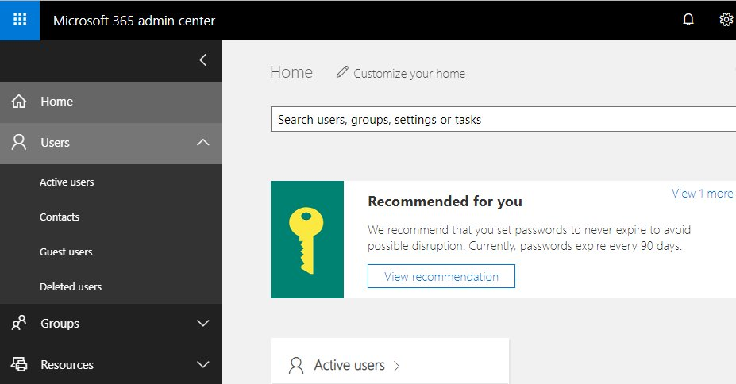

1. `Bill Sluss` teaches the `Technology - Programming 2` class. Click his name.

    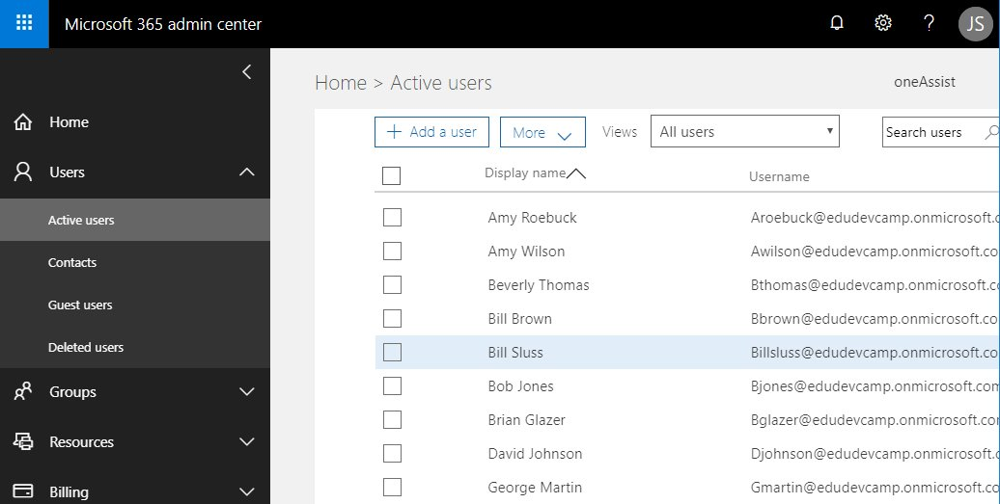

1. You can see the classes Bill teaches as group memberships. His username is `billsluss@yourdomain.onmicrosoft.com`.

    

1. Return to the list of active users and repeat the process for one of Bill's students in the `Technology - Programming 2` class: `Jane Doe`.

1. Start the Teams client. Click the initials of the logged in user in the upper right corner and select `Sign out`.

    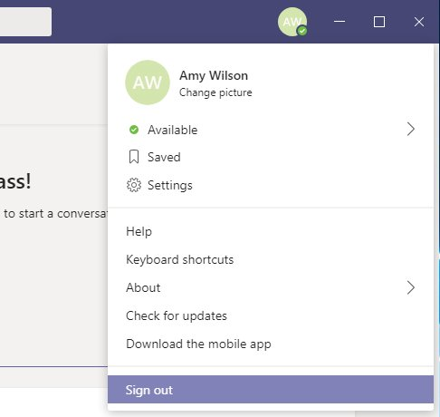

1. Teams will automatically restart and display the login dialog. Login as `Bill Sluss` (`billsluss@yourdomain.onmicrosoft.com`) using the password `P@ssword`.

    

1. Note the classes in the list of teams that Bill teaches. Select `Technology - Programming 2` and create a new assignment.

    

    

    

1. Log out and log in again as `Jane Doe` (`jdoe@yourdomain.onmicrosoft.com`), again using the password `P@ssword`.

    

1. Note that the `Technology - Programming 2` class and the assignment show up for the student.

    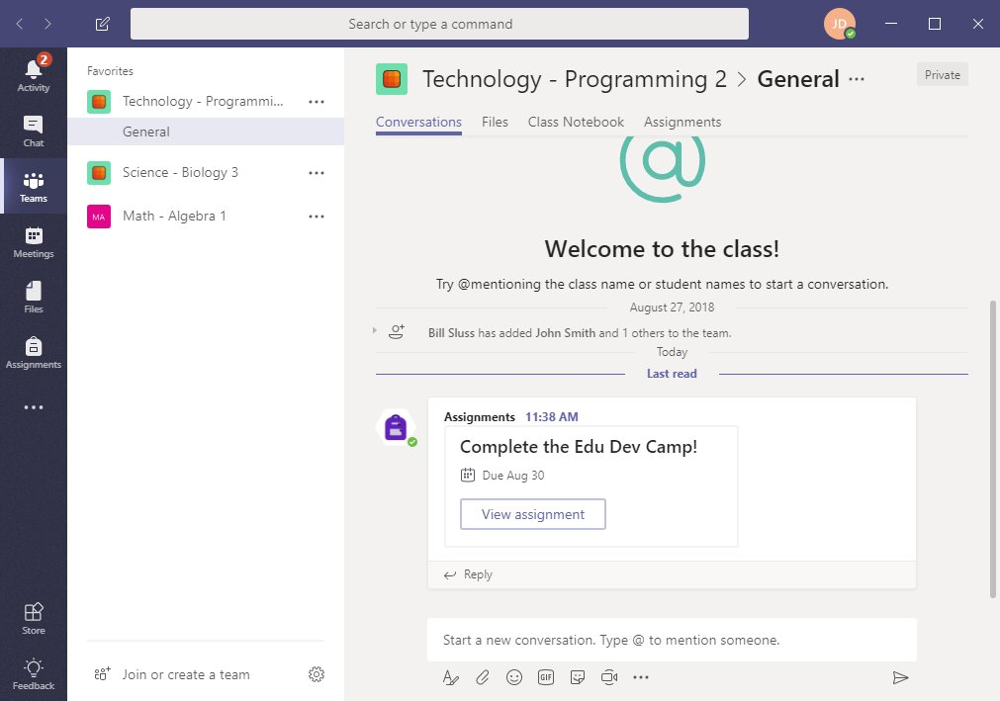

[Back to top](#content)

---

## Exercise 4: Create a Teams app
Now you will add your own tab app to Teams. A tab app is a web application that runs within the teams client. The app will be hosted as an Azure app service. Some preparations are necessary before you can start coding.

### Create an app service in Azure

You need the Azure trial subscription created in HOL 0.

1. Open a InPrivate or Incognito browser window (`Ctrl + Shift + P` in Edge and Internet Explorer and Firefox or `Ctrl + Shift + N` in Google Chrome) and browse to [teams.microsoft.com](https://portal.azure.com/). Click `App Services` on the left menu and `Add` at the top of the page.

    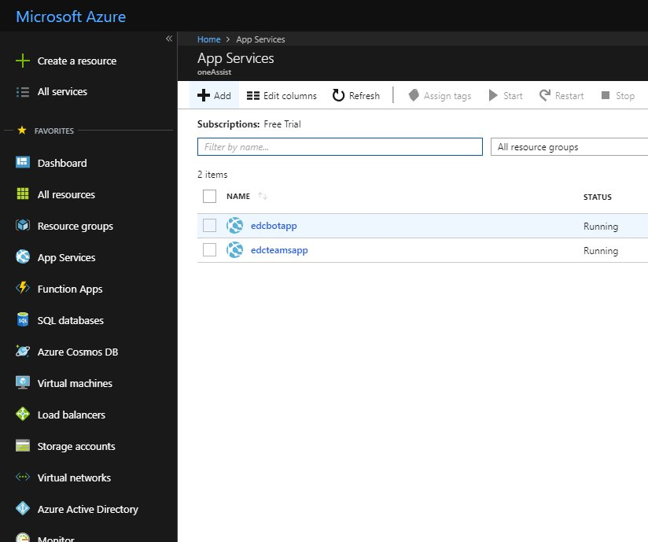

1. We will create a simple HTML based app with inline JavaScript code so it will be sufficient to use the `Web App` template. Select it and click `Create`.

    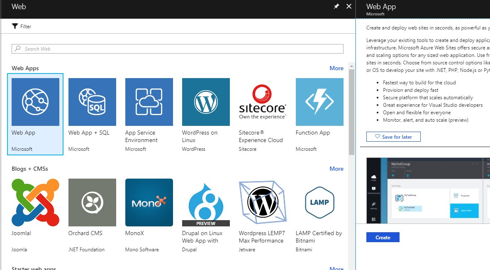

1. Enter a name for your new app, select the resource group you used to create the virtual machine in HOL 0 and click `Create`.

    

1. A notification will tell you when the deployment finished.

    

1. Navigate to your web app and click `Browse` at the top of the page.

    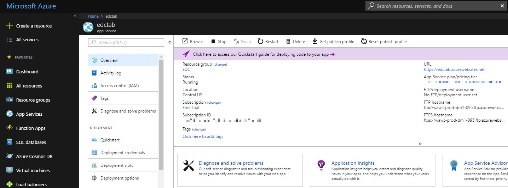

1. A new browser tab will open and tell you that your app service is running. Now you can upload your app to be hosted in Azure. Note the URL of your app service. You will need to add it to your code.

    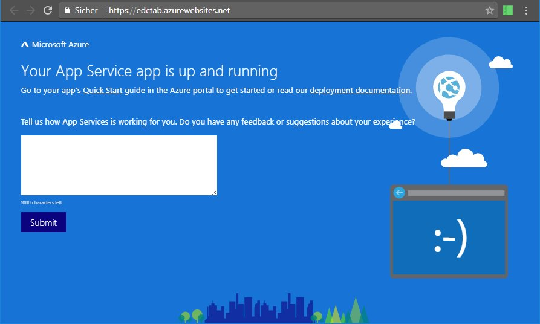

### Register a new app

For your app to be able to gain permissions to Microsoft Graph API you will need an app id.

1. Open a InPrivate or Incognito browser window (`Ctrl + Shift + P` in Edge and Internet Explorer and Firefox or `Ctrl + Shift + N` in Google Chrome) and browse to [http://apps.dev.microsoft.com](http://apps.dev.microsoft.com) and sign in.

    

1. Click `Add an app`, enter a name for your app and click `Create`.

    

1. Note the `Application Id` value.

    

1. Scroll down to the `Platforms` section and click `Add Platform`.

    

1. Select `Web`.

    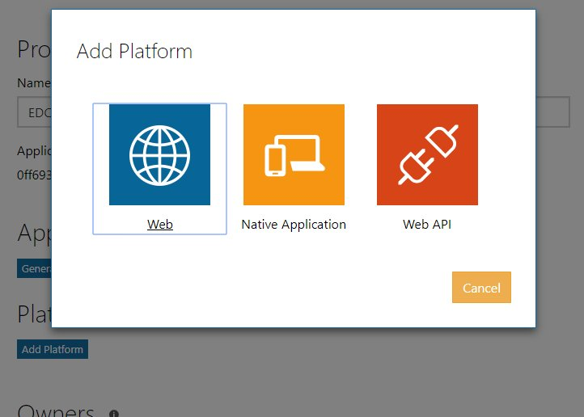

1. Paste the URL to your web app that you noted when you created the Azure app service and add `/silent-end.html` (a page you will be creating as part of your app). This is the URL that the authentication service will redirect to after the authentication has been completed.

    

1. Scroll down to the `Microsoft Graph Permissions section` and click `Add` next to TODOTODOTODO Permissions.

    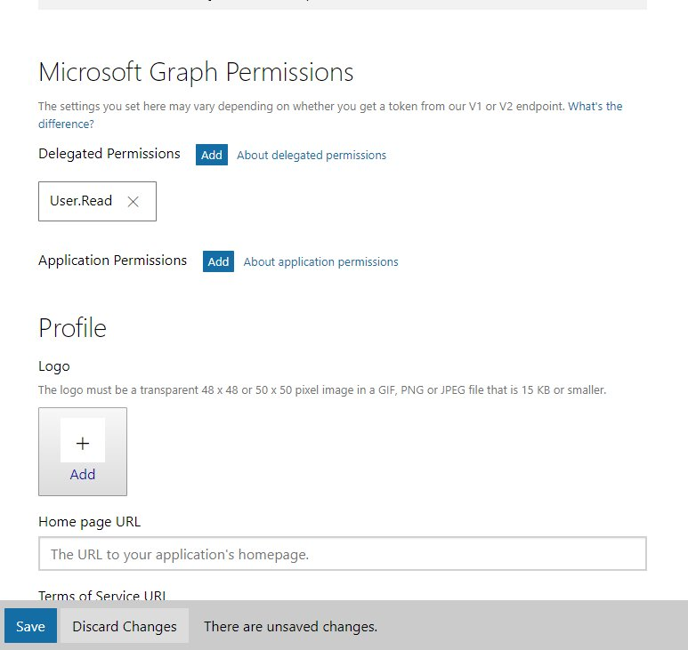

1. Select TODOTODOTODO... and click TODO.

1. To finish the configuration click `Save` at the bottom of the screen.

    

### Write your app

1. Download the HTML files from the [app](./assets/app) folder.

1. Start Visual Studio and click `File` -> `Open` -> `Folder...`.

    

1. The `Solution Explorer` shows the loaded HTML files.

    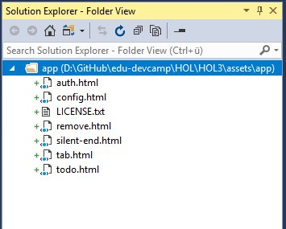

1. ...

1. ...

1. ...

1. You need a manifest file that will tell Teams all about your app. Download the 3 files from the [manifest](./assets/manifest) folder and use Visual Studio to open `manifest.json`.

TODO add yourself to an existing class

1. Deploy ZIP file

1. Browse to the app

### Allow external apps in Teams

You must configure your Office 365 to allow Teams the use of external apps (that you uploaded yourself).

1. Open a InPrivate or Incognito browser window (`Ctrl + Shift + P` in Edge and Internet Explorer and Firefox or `Ctrl + Shift + N` in Google Chrome)
 and browse to [portal.office.com](https://portal.office.com) and enter your O365 Global Admin account credentials. 

1. Click `Services & add-ins` and select `Microsoft Teams`.

    

1. Expand the `Apps` section .

    

1. Check `Allow external apps in Microsoft Teams` and `Allow sideloading of external apps` and `Enable new external apps by default`. Click `Save`.

    

### Upload and test your new tab

1. ...

1. ...

### Install App Studio

Microsoft Teams includes an app that helps you create your own apps. This is App Studio. You can find it in the store.

1. In Microsoft Teams click `Store` which can be found on the bottom left.

    

1. Use the search to find `App Studio`.

    

1. Select `App Studio` and click `Install`.

    

### Create an app manifest file

App Studio will create the manifest files for your new apps. It also provides ready to use controls for your user interface. Here is an example:

1. Click `Open` next to `App`.

    

1. On the welcome screen click `Create a new app`.

    

1. Provide details for all fields. Click `Generate` to generate a new App ID. Upload two icon files in the `Branding` section.

    

1. After you have completed the `Details` -> `App details` page click `Capabilities` -> `Tabs` on the left hand menu to go to the next page. Click the `Add` button below `Team tab`.

    

1. ...

1. ...

[Back to top](#content)

---

## Continue with lab 4

You are now ready to start hands-on lab 4. [View HOL 4 instructions](../HOL4).

[Back to top](#content)

---

Copyright 2018 Microsoft Corporation. All rights reserved. Except where otherwise noted, these materials are licensed under the terms of the MIT License. You may use them according to the license as is most appropriate for your project. The terms of this license can be found at https://opensource.org/licenses/MIT.