# Monitoring with Application Insights

## Content<a name="content"></a>
* [Overview](#overview)
* [Prerequisites](#prerequisites)
* [Exercise 1: Create a web app and add the Application Insight SDK](#ex1)
* [Exercise 2: Monitoring](#ex2)
* [Exercise 3: Advanced tracking and monitoring custom events](#ex3)
* [Continue with lab 5](#continue)

---

## Overview<a name="overview"></a>
In this lab, you will learn how to integrate Application Insights in your applications to monitor them.

[Back to top](#content)

---

## Prerequisites<a name="prerequisites"></a>

* Complete [HOL 0](./../HOL0) to create a development image with Visual Studio 2017.

[Back to top](#content)

---

## Exercise 1: Create a web app and add the Application Insight SDK<a name="ex1"></a>

An instance of Application Insights can be created in a variety of ways, including ARM Templates or CLI commands or manually via the Azure Portal. For this exercise we will use Visual Studio to create and configure our instance. Application Insights works with a server side SDK that integrates into web technology processes. We will add the SDK to a sample application.

1. Open Visual Studio and click `File` -> `New` -> `Project...`.

    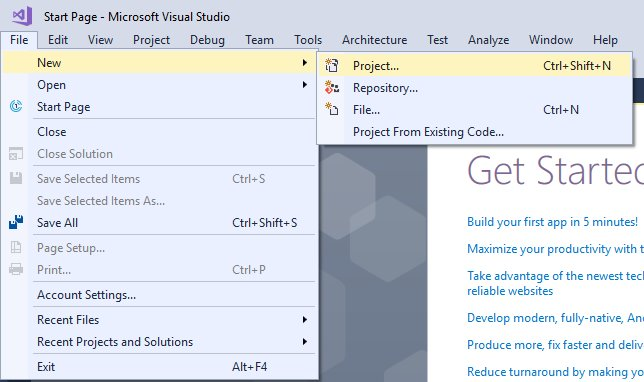

1. Select `ASP.NET Web Application (.NET Framework)` from `Visual C#` -> `Web` and click `OK`.

    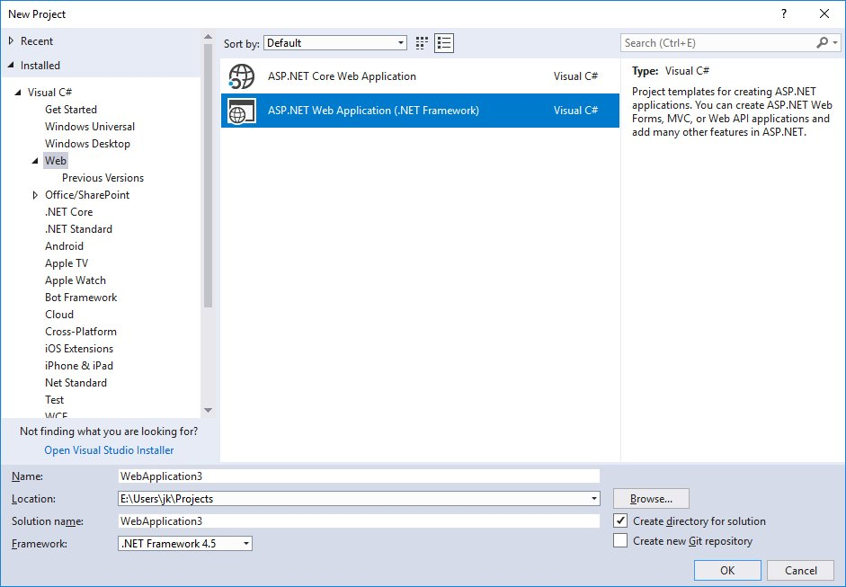

1. On the configuration screen select `Web Forms` and click `OK`.

    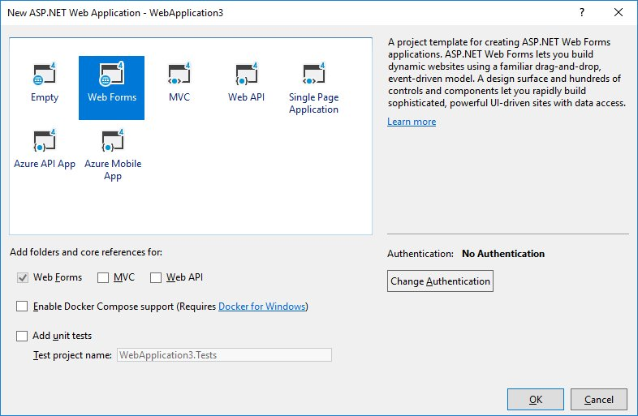

1. In the `Solution Explorer` right-click on the project and click `Add` -> `Application Insights Telemetry...`.

    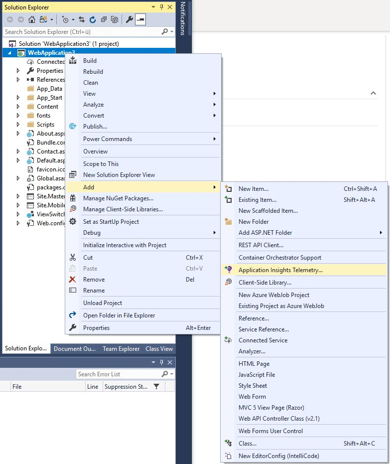

1. On the configuration screen select `Get Started`.

    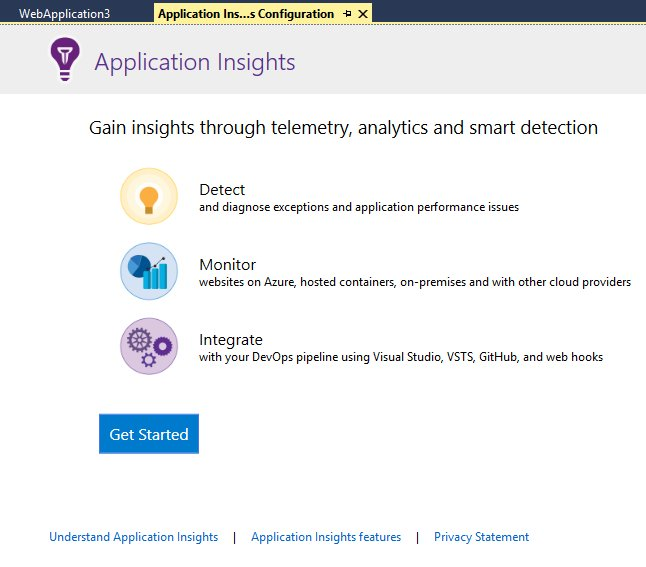

1. Select your Account and Subscription. Click `Configure settings...`. 

    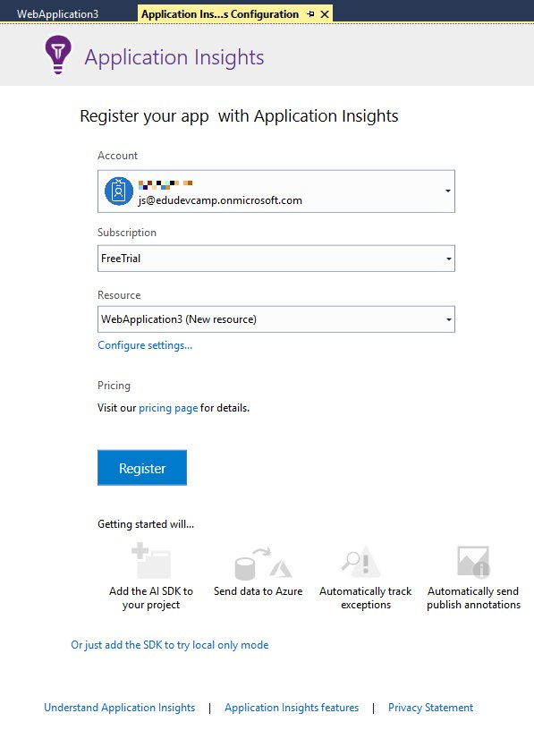

1. Select the Resource Group you have created for the HOLs and let Visual Studio create a new Application Insights Resource for you by keeping the selected value for the second selection. Click `OK`.

    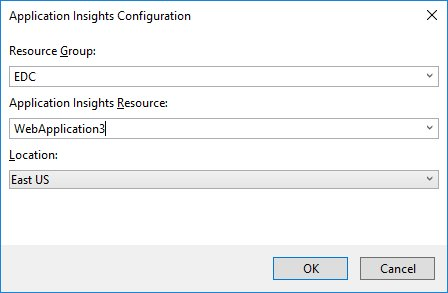

1. Click `Register`.The setup by Visual Studio will take a few minutes.

    

1. The result will show 75% coverage. Click `Collect traces from System.Diagnostics` to cover the remaining 25%.

    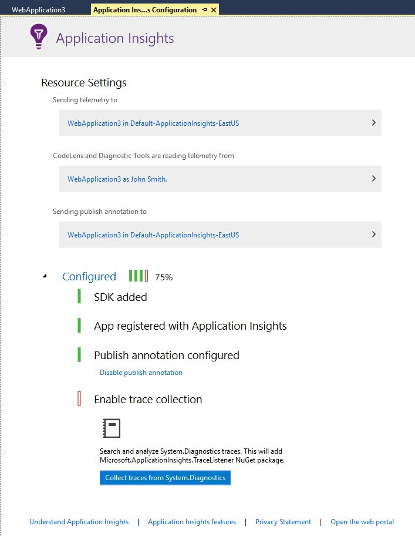

1. Application Insights is now completely configured.

    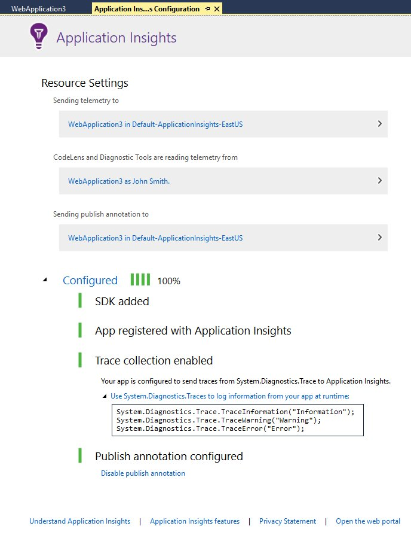

1. Press `F5` to start the sample application. It consists of a `Home`, an `About` and a `Contact` page. Click all the links on top to navigate between the pages multiple times to generate some telemetry.

    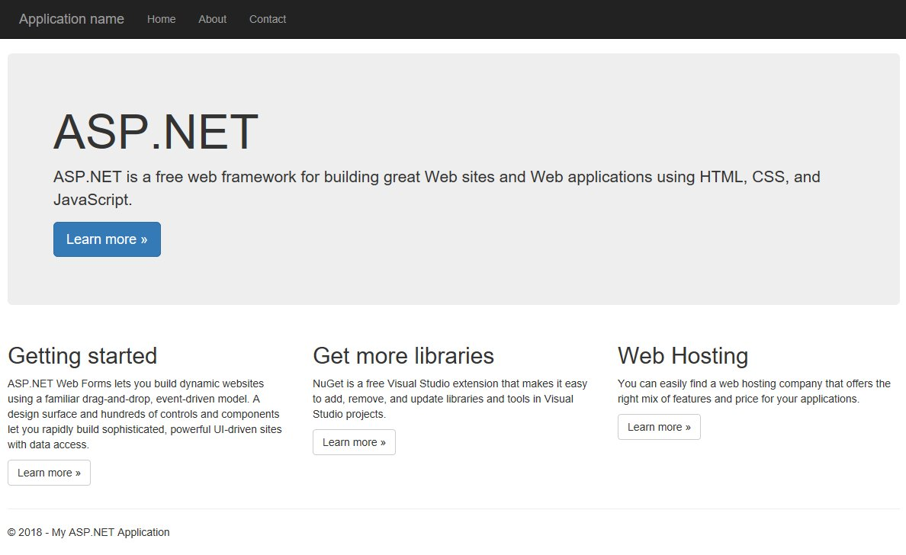

1. The `ApplicationInsights.config` in your project contains the `Instrumentation Key`.

    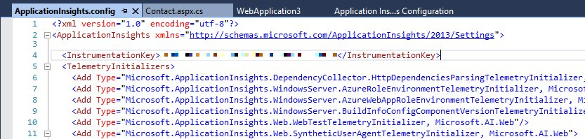

We now have an instance of Application Insights created and ready for data gathering. The Instrumentation Key is important, as it is the link that ties an application to the AI service.

The integration was done automatically by Visual Studio. When you are creating an ASP.NET web application **hosted** in Azure you can simply activate monitoring via the Azure Portal and don't have to touch your code at all.

[Back to top](#content)

---

## Exercise 2: Monitoring<a name="ex2"></a>

The telemetry data you have just created is available in the Azure Portal with just a few minutes of delay.

1. Open a InPrivate or Incognito browser window (`Ctrl + Shift + P` in Edge and Internet Explorer and Firefox or `Ctrl + Shift + N` in Google Chrome)
 and browse to [portal.azure.com](https://portal.azure.com/). Click `Resources` and select your resource. In the list of resources find the newly created Application Insights resource.

    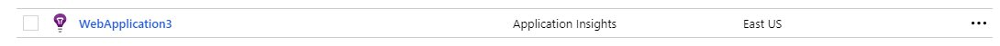

1. You will be treated with an automatically created dashboard of analytics. Click `Metrics` on the left side menu bar.

    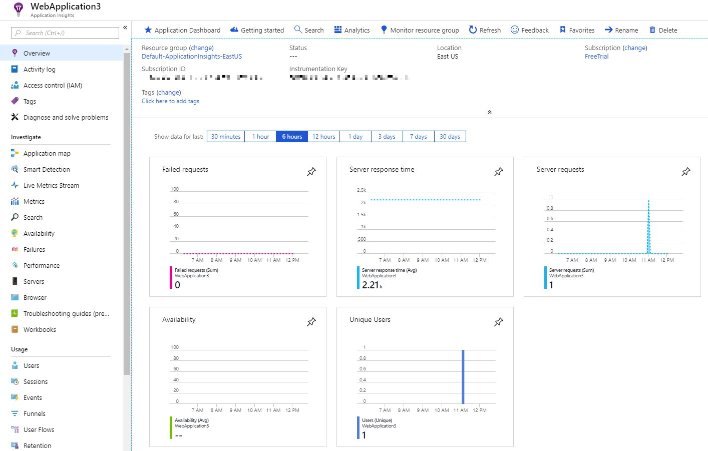

1. Here you can select different types of metrics from the menu bar and see the data displayed as a graph.

    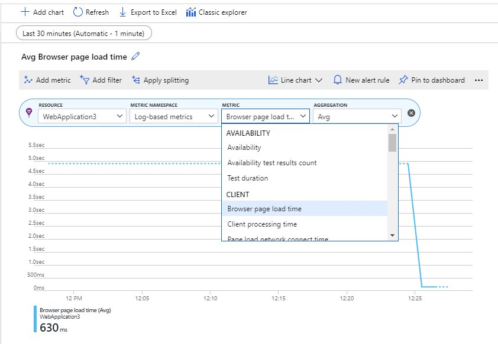

    > It may take 3-5 minutes for data to appear even when manually refreshing.

1. Click `Performance` on the left side menu bar next. This page displays data about individual page calls and serving times.

    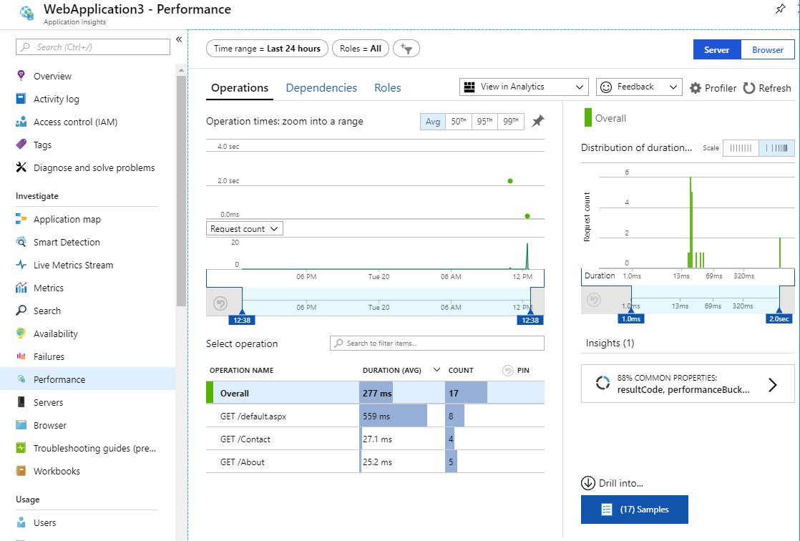

Other pages like `Failures` and `Availability` can display more data for real-world applications and provide useful instruments for your web application management.

Later you will learn to further improve the level of detail by adding custom events.

---

## Exercise 3: Advanced tracking and monitoring custom events<a name="ex3"></a>

You can use the `Metric Explorer` to create custom views on the gathered data. Application Insights allows you to use many advanced tracking options. For example you can track custom events and add custom properties to the tracked data.

1. In your code open the Modify the `contact.aspx.cs` file.

    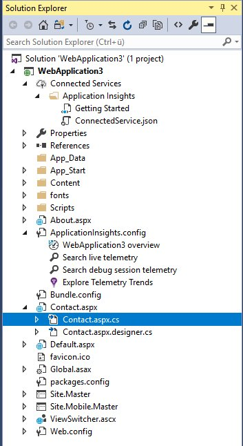

1. In the `Page_Load` method add these two lines of code.

    ```csharp
    Microsoft.ApplicationInsights.TelemetryClient telemetryClient = new Microsoft.ApplicationInsights.TelemetryClient();
    telemetryClient.TrackEvent("Contacted");
    ```

    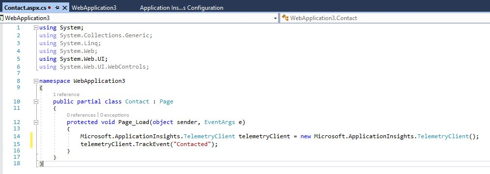

1. The code will track a custom event called `Contacted` every time the contact page is loaded. Tracking can be done from anywhere within your code. This allows you to monitor every information that is relevant for your company. Press `F5` to start the sample application and navigate to the `Contact` page and back to the home page a few times to generate new telemetry.

1. Back in the Azure Portal open the `Metric` page and select `Events` from the list of Metrics to see the events you have caused.

    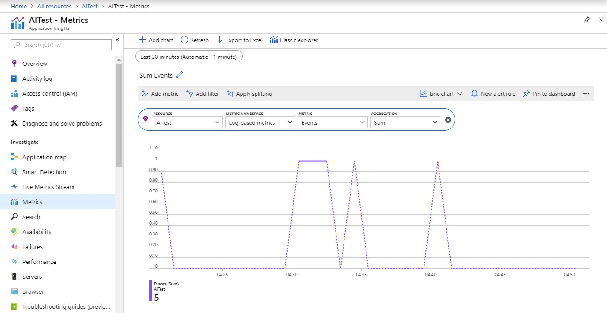

1. Click the `Classic explorer` link on the top. The classic explorer does not only show you graphs but lists all events individually. In the list of events you will be able to find the custom `Contacted` event you added to your code.

    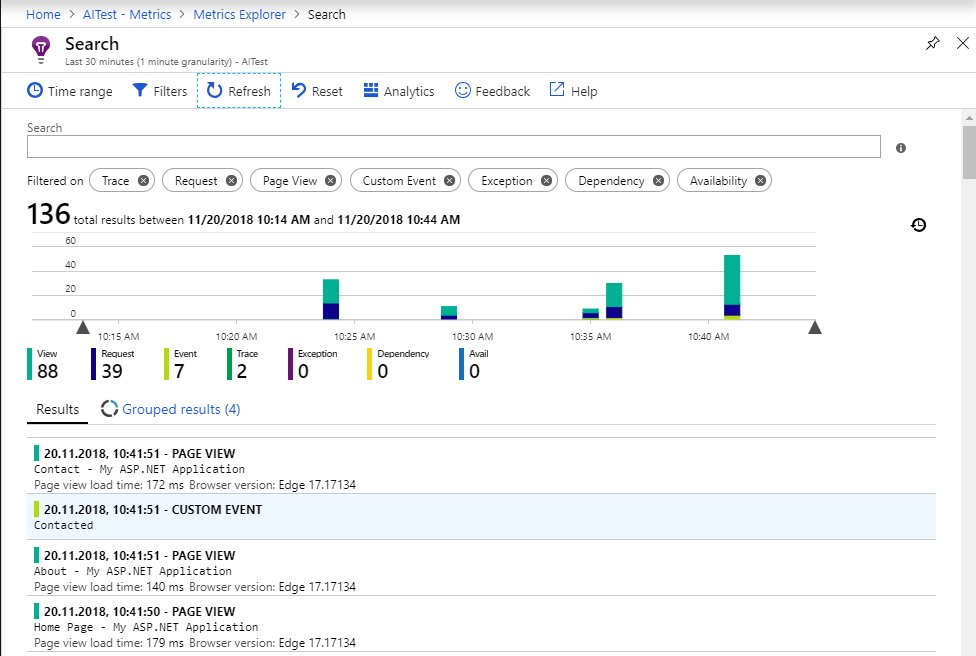

This was a short introduction into tracking using the Application Insights SDK and the `Metric Explorer`. See [docs.microsoft.com/en-us/azure/application-insights/app-insights-api-custom-events-metrics](https://docs.microsoft.com/en-us/azure/application-insights/app-insights-api-custom-events-metrics) for additional tracking options.

[Back to top](#content)

---

## Continue with lab 5

You are now ready to start hands-on lab 5. [View HOL 5 instructions](../HOL5).

[Back to top](#content)

---

Copyright 2018 Microsoft Corporation. All rights reserved. Except where otherwise noted, these materials are licensed under the terms of the MIT License. You may use them according to the license as is most appropriate for your project. The terms of this license can be found at https://opensource.org/licenses/MIT.