# Monitoring with Application Insights

## Content<a name="content"></a>
* [Overview](#overview)
* [Prerequisites](#prerequisites)
* [Exercise 1: Create an Application Insights resource](#ex1)
* [Exercise 2: Add the Application Insight SDK](#ex2)
* [Exercise 3: Advanced tracking and monitoring custom events](#ex3)
* [Download the finished PWA solution](#download)
* [Continue with lab 5](#continue)

---

## Overview<a name="overview"></a>
In this lab, you will set up Microsoft Teams on your system, create your first team and create a custom Teams app hosted in Microsoft Azure.

[Back to top](#content)

---

## Prerequisites<a name="prerequisites"></a>

* Complete [HOL 0](./../HOL0) to create a development image with Visual Studio 2017.
* Complete [HOL 2](./../HOL2) to create a basic Progressive Web App, or use the [PWA](./../HOL2/PWA) folder from lab 2 without completing it.

[Back to top](#content)

---

## Exercise 1: Create an Application Insights resource<a name="ex1"></a>

An instance of Application Insights can be created in a variety of ways, including ARM Templates or CLI commands. For this exercise we will use the Azure Portal to create and configure our instance.

1. Open a InPrivate or Incognito browser window (`Ctrl + Shift + P` in Edge and Internet Explorer and Firefox or `Ctrl + Shift + N` in Google Chrome)
 and browse to [portal.azure.com](https://portal.azure.com/). Click `Downloads` and select `Desktop (Windows 7+)` and click `DOWNLOAD NOW (64-BIT)`.


1. Open the Resource Group that was originally deployed. Click `Add` on the top toolbar to add a new Azure resource to this group.


1. Search for `Application Insights` and select the entry from the results list:


1. In the overview blade that opens, click `Create` to open the creation settings blade. Enter a name, configure `Application Type` to `Node.js Web Application` and then click the `Create` button.

    Creation typically takes less than a minute.


1. Once provisioning completes, return to your Resource Group and open the resource. You may need to hit the refresh button within the resource group blade.


1.  In the `Essentials` section, take note of the `Instrumentation Key`. We will need that in future exercises.


We now have an instance of Application Insights created and ready for data. The Instrumentation Key is important, as it is the link that ties an application to the AI service. 

[Back to top](#content)

---

## Exercise 2: Add the Application Insight SDK<a name="ex2"></a>

Application Insights works with a server side SDK that integrates into the NodeJS (or other web technologies) processes. We will add the SDK to our application and enable the sending of telemetry into the Application Insights service.

1. Open the application in Visual Studio. Feel free to use the folder you've been using throughout the hands-on-labs, or use the [PWA](./../HOL2/PWA) folder from lab 2.

1. Microsoft publishes an SDK for AppInsights on NodeJS on [GitHub](https://github.com/Microsoft/ApplicationInsights-node.js). This SDK can be installed in your project via the Visual Studio package management console.

    Open the package management console (`View` -> `Other Windows` -> `Package Manager Console`), switch to the solution directory and install the npm package `applicationinsights`:

    ```javascript
    cd EduDevCampPWA
    npm install --save applicationinsights
    ```

    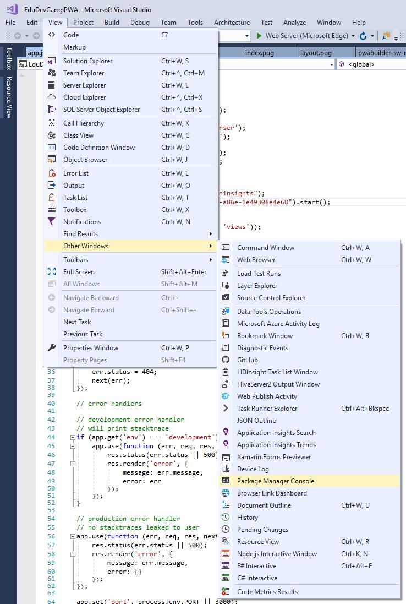
    
    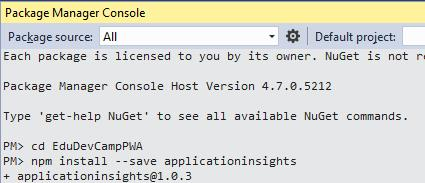

1. Modify the `app.js` file and add the following code below the line

    ```javascript
    var app = express();
    ```

    and make sure that you replace `YOUR_I_KEY` with the `Instrumentation Key` you created in the previous exercise:

    ```javascript
    let appInsights = require("applicationinsights");
    appInsights.setup("YOUR_I_KEY").start();
    ```

    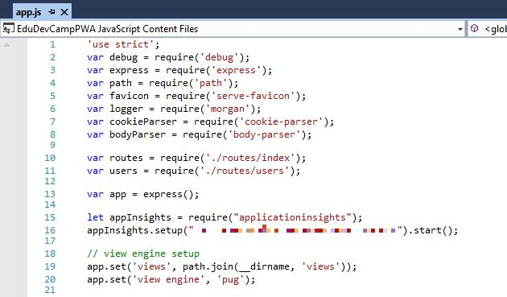

1. Run your application and in the navigate around several pages to generate sample telemetry.

1. Back in the Azure Portal, refresh the browser tab (or click `Refresh` from the top toolbar) until you see data appear.

    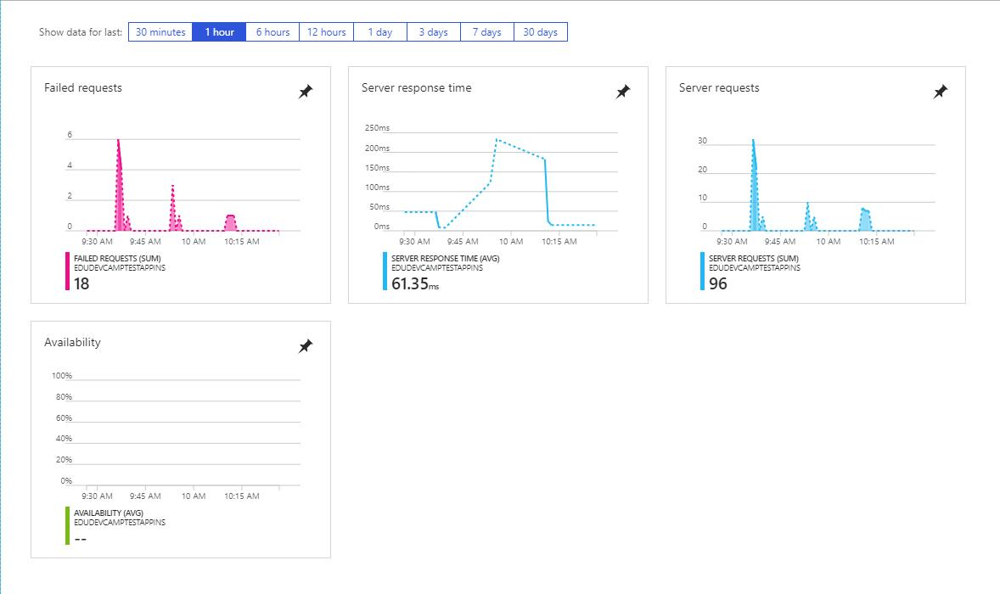

    > It may take 3-5 minutes for data to appear even when manually refreshing.

With just two lines of code you added monitoring to your website. Later you will learn to further improve the level of detail by adding custom events.

When you are creating an ASP.NET web application hosted in Azure you can simply activate monitoring via the Azure UI and don't have to change your code at all.

---

## Exercise 3: Advanced tracking and monitoring custom events<a name="ex3"></a>

You can use the `Metric Explorer` to create custom views on the gathered data. Application Insights allows you to use many advanced tracking options. For example you can track custom events and add custom properties to the tracked data.

1. Modify the `app.js` file. Below:

    ```javascript
    appInsights.setup("YOUR_I_KEY").start();
    ```

    add:

    ```javascript
    appInsights.defaultClient.commonProperties = {
        userLoggedIn: true,
        userIsTeacher: false
    };
    appInsights.defaultClient.trackEvent({ name: "onClick" });
    ```
    
    The first part will add two custom properties to the tracked data (in a real world scenario you would use them to track if the current visitor is a login user and if it is a teacher or not). The second part will cause `onClick` events to be tracked.

1. Modify the `views` -> `index.pug` and add this `onClick` event that we will use to test the advanced tracking at the end of the file:

    ```javascript
      p(onclick="alert('test');")= "Click to cause an event"
    ```

1. Run your application and click the `Click to cause an event` text.

    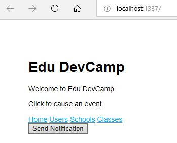

1. Back in the Azure Portal open the `Metric Explorer` and click `edit` on the empty chart (if you don't have an empty chart, click `Add chart`).

    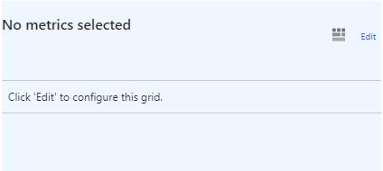

1. Select `Events` from the list of Metrics.

    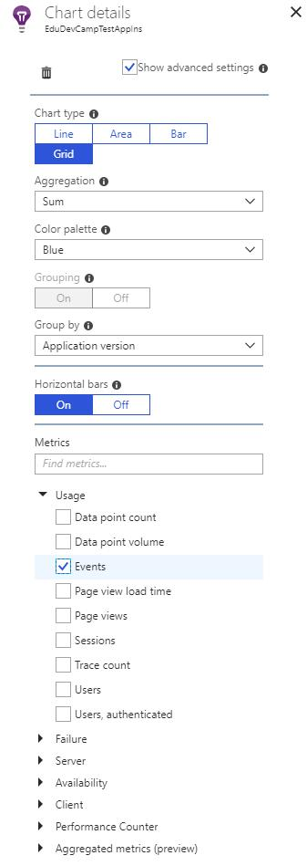

1. As soon as you do you see a bar chart listing all custom events. Click the bar chart to open the search page.

    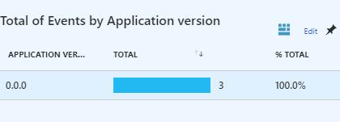

1. Click the first custom event in the result list to see the details.

    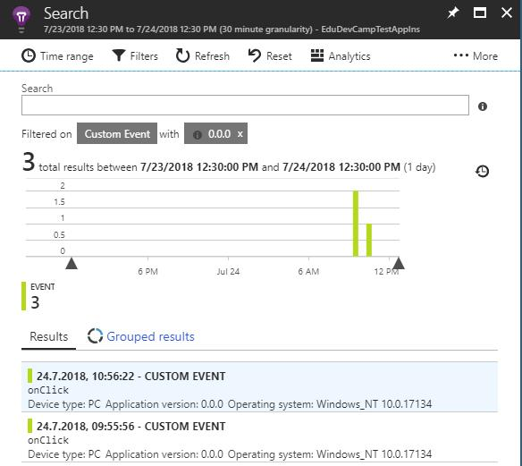

1. Note the custom data that you defined previously.

    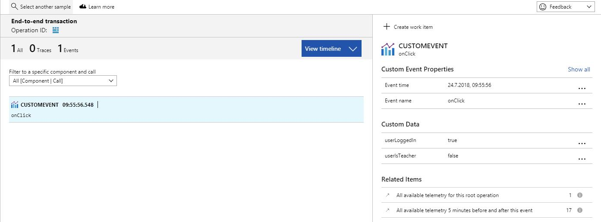

This was a short introduction into tracking using the Application Insights SDK and the `Metric Explorer`. See [docs.microsoft.com/en-us/azure/application-insights/app-insights-api-custom-events-metrics](https://docs.microsoft.com/en-us/azure/application-insights/app-insights-api-custom-events-metrics) for additional tracking options.

[Back to top](#content)

---

## Download the finished PWA solution<a name="download"></a>

If you want to skip this hands-on-lab or if you run into any problems you can download the finished solution from the [PWA](./PWA) folder. To start debugging you have to right-click the `npm` node in the Solution Explorer and select `Update npm Packages` first.

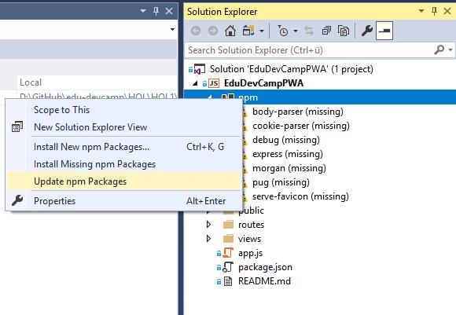

[Back to top](#content)

---

## Continue with lab 5

You are now ready to start hands-on lab 5. [View HOL 5 instructions](../HOL5).

[Back to top](#content)

---

Copyright 2018 Microsoft Corporation. All rights reserved. Except where otherwise noted, these materials are licensed under the terms of the MIT License. You may use them according to the license as is most appropriate for your project. The terms of this license can be found at https://opensource.org/licenses/MIT.