# Bot Framework and Cognitive Services

## Content<a name="content"></a>
* [Overview](#overview)
* [Prerequisites](#prerequisites)
* [Exercise 1: Create a Language Understanding bot with Bot Service](#ex1)
* [Exercise 2: Try the bot](#ex2)
* [Exercise 3: Modify the LUIS app](#ex3)
* [Exercise 4: Modify the bot code](#ex4)
    * [Edit the default message handler](#ex4a)
    * [Handle the Note.Create intent](#ex4b)
    * [Handle the Note.Delete intent](#ex4c)
    * [Handle the Note.ReadAloud intent](#ex4d)
    * [The completed code](#ex4e)
* [Exercise 5: Test the bot](#ex5)
* [Exercise 6: Add the bot to Teams](#ex6)
    * [Add the Microsoft Teams channel](#ex6a)
    * [Install App Studio](#ex6b)
    * [Create an app manifest file](#ex6c)
    * [Install the bot](#ex6d)
* [Continue with lab 7](#continue)

---

## Overview<a name="overview"></a>
In this lab, you will learn how to create an Azure bot, make it available in Teams and use Language Understanding to identify the user's intent. The bot will help the students by taking notes for them.

[Back to top](#content)

---

## Prerequisites<a name="prerequisites"></a>

* Complete [HOL 0](./../HOL0) to set up an Azure account.
* Complete [HOL 2](./../HOL2) to install the Microsoft Teams client and to allow allow external apps in Teams.

[Back to top](#content)

---

## Exercise 1: Create a Language Understanding bot with Bot Service<a name="ex1"></a>

1. Open a InPrivate or Incognito browser window (`Ctrl + Shift + P` in Edge and Internet Explorer and Firefox or `Ctrl + Shift + N` in Google Chrome) and browse to [portal.azure.com](https://portal.azure.com) and sign in. Select `Create new resource` in the menu blade and search for `bot`.

    

1. Select the `Web App Bot` from the results.

1. In the `Bot Service blade`, provide the required information, and click `Create`. This creates and deploys the bot service and LUIS app to Azure.

    1. Set `App name` to your bot's name. The name is used as the subdomain when your bot is deployed to the cloud (for example, `edcbot.azurewebsites.net`). This name is also used as the name of the LUIS app associated with your bot. Copy it to use later, to find the LUIS app associated with the bot.

    1. Select the `subscription`, `resource group`, `App service plan`, and `location`.

    1. Select the `Language understanding (Node.js)` template for the `Bot template` field.

    1. Note that Azure will automatically create a storage and an App ID for your bot.

    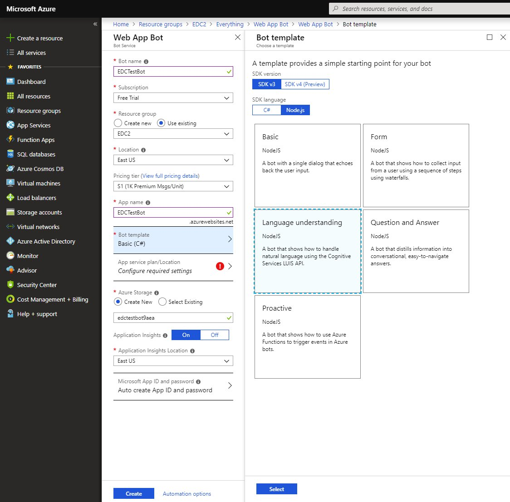

1. Confirm that the bot service has been deployed. Click `Notifications` (the bell icon that is located along the top edge of the Azure portal). The notification will change from `Deployment started` to `Deployment succeeded`. After the notification changes to `Deployment succeeded`, click `Go to resource` on that notification.

[Back to top](#content)

---

## Exercise 2: Try the bot<a name="ex2"></a>

1. Once the bot is registered, click `Test in Web Chat` to open the Web Chat pane. Type `hello` in Web Chat. The bot responds by saying `You have reached Greeting. You said: hello`. This confirms that the bot has received your message and passed it to a default LUIS app that it created. This default LUIS app detected a Greeting intent.

    

1. Try `can you help me?` and see how the bot recognizes your help intend.

    

1. And `I wish to cancel` or variations of the texts.

    

Your bot is now running and can recognize some basic intents. Next you are going to add intents that correspond to taking and deleting notes.

[Back to top](#content)

---

## Exercise 3: Modify the LUIS app<a name="ex3"></a>

1. Log in to [www.luis.ai/applications](https://www.luis.ai/applications) using the same account you use to log in to Azure. Click on `My apps` if you are not redirected automatically. In the list of apps, find the app that begins with the name specified in `App name` in the Bot Service blade when you created the Bot Service.

    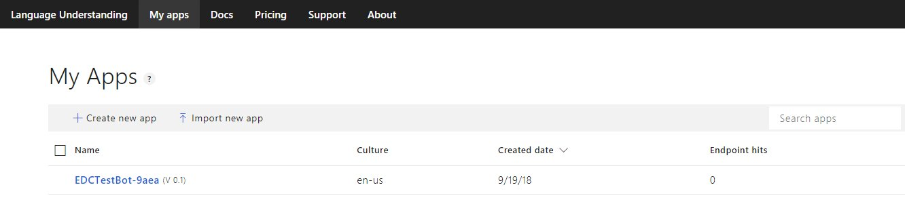

1. The LUIS app starts with 4 intents: `Cancel`, `Greeting`, `Help`, and `None`. Click on `Add prebuilt intent` in the top menu. Type `note` in the search box.

    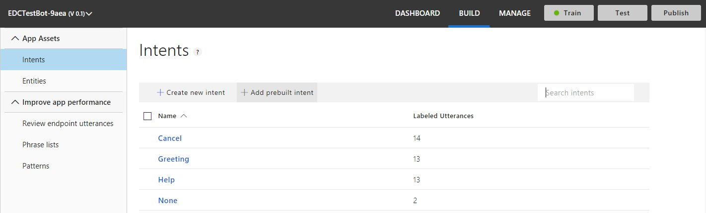

1. Select `Node.Create`, `Node.Delete` and `Note.ReadAloud` and click `Done`.

    

1. Click the `Train` button in the upper right to train your app.

    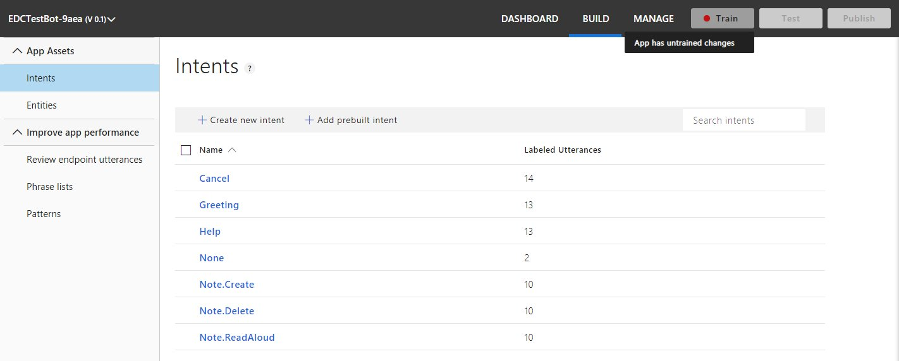

1. Click the `Publish` button in the upper right to train your app.

    

1. Confirm the `Environment` by clicking `Publish` in the dialog.

    

Your LUIS app now distinguishes between more intents. Next you are going to modify your bot to react to these new intents.

[Back to top](#content)

---

## Exercise 4: Modify the bot code<a name="ex4"></a>

1. Return to the Azure Portal and go to the `App Service` associated with your bot. From the menu click `App Service Editor (Preview)`.

    

1. Click `Go`.

    

1. Select the `app.js` file. This is the code your bot is currently running. You can also find the sample code described in [this article](https://github.com/Microsoft/BotFramework-Samples/tree/master/docs-samples/Node/basics-naturalLanguage) in the Notes bot sample. The article contains more ideas on how to improve your LUIS bot.

    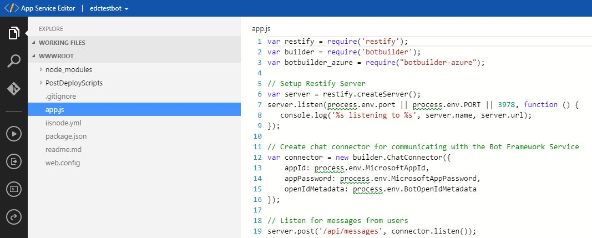

### Create a team<a name="ex4a"></a>

1. Change the welcome message to explain the bot's function and create a session to store the notes. The bot has a default message handler. Edit it to match the following:

    ```javascript
    // Create your bot with a function to receive messages from the user.
    // This default message handler is invoked if the user's utterance doesn't
    // match any intents handled by other dialogs.
    var bot = new builder.UniversalBot(connector, function (session, args) {
        session.send("Hello student. I'm a note taking bot. I can create new notes, read saved notes to you and delete notes.");
    
       // If the object for storing notes in session.userData doesn't exist yet, initialize it
       if (!session.userData.notes) {
           session.userData.notes = {};
           console.log("initializing userData.notes in default message handler");
       }
    });
    ```

### Handle the Note.Create intent<a name="ex4b"></a>

1. When the LUIS app recognizes a note creation intent the bot has to react by interacting with the student to gather all the necessary data. A new dialog will do this .Copy the following code and paste it at the end of `app.js`:

    ```javascript
    // CreateNote dialog
    bot.dialog('CreateNote', [
        function (session, args, next) {
            // Resolve and store any Note.Title entity passed from LUIS.
            var intent = args.intent;
            var title = builder.EntityRecognizer.findEntity(intent.entities, 'Note.Title');
    
            var note = session.dialogData.note = {
              title: title ? title.entity : null,
            };
            
            // Prompt for title
            if (!note.title) {
                builder.Prompts.text(session, 'What would you like to call your note?');
            } else {
                next();
            }
        },
        function (session, results, next) {
            var note = session.dialogData.note;
            if (results.response) {
                note.title = results.response;
            }
    
            // Prompt for the text of the note
            if (!note.text) {
                builder.Prompts.text(session, 'What would you like to say in your note?');
            } else {
                next();
            }
        },
        function (session, results) {
            var note = session.dialogData.note;
            if (results.response) {
                note.text = results.response;
            }
            
            // If the object for storing notes in session.userData doesn't exist yet, initialize it
            if (!session.userData.notes) {
                session.userData.notes = {};
                console.log("initializing session.userData.notes in CreateNote dialog");
            }
            // Save notes in the notes object
            session.userData.notes[note.title] = note;
    
            // Send confirmation to user
            session.endDialog('Creating note named "%s" with text "%s"',
                note.title, note.text);
        }
    ]).triggerAction({ 
        matches: 'Note.Create',
        confirmPrompt: "This will cancel the creation of the note you started. Are you sure?" 
    }).cancelAction('cancelCreateNote', "Note canceled.", {
        matches: /^(cancel|nevermind)/i,
        confirmPrompt: "Are you sure?"
    });
    ```

1. Any entities in the utterance are passed to the dialog using the `args` parameter. The first step of the waterfall calls `EntityRecognizer.findEntity` to get the title of the note from any `Note.Title` entities in the LUIS response. If the LUIS app didn't detect a `Note.Title` entity, the bot prompts the user for the name of the note. The second step of the waterfall prompts for the text to include in the note. Once the bot has the text of the note, the third step uses `session.userData` to save the note in a `notes` object, using the title as the key. For more information on `session.UserData` see [Manage state data](https://docs.microsoft.com/en-us/azure/bot-service/nodejs/bot-builder-nodejs-state?view=azure-bot-service-3.0).

### Handle the Note.Delete intent<a name="ex4c"></a>

1. Just as for the `Note.Create` intent, the bot examines the `args` parameter for a `title`. If no title is detected, the bot prompts the user. The title is used to look up the note to delete from `session.userData.notes`. Copy the following code and paste it at the end of `app.js`:

    ```javascript
    // Delete note dialog
    bot.dialog('DeleteNote', [
        function (session, args, next) {
            if (noteCount(session.userData.notes) > 0) {
                // Resolve and store any Note.Title entity passed from LUIS.
                var title;
                var intent = args.intent;
                var entity = builder.EntityRecognizer.findEntity(intent.entities, 'Note.Title');
                if (entity) {
                    // Verify that the title is in our set of notes.
                    title = builder.EntityRecognizer.findBestMatch(session.userData.notes, entity.entity);
                }
                
                // Prompt for note name
                if (!title) {
                    builder.Prompts.choice(session, 'Which note would you like to delete?', session.userData.notes);
                } else {
                    next({ response: title });
                }
            } else {
                session.endDialog("No notes to delete.");
            }
        },
        function (session, results) {
            delete session.userData.notes[results.response.entity];        
            session.endDialog("Deleted the '%s' note.", results.response.entity);
        }
    ]).triggerAction({
        matches: 'Note.Delete'
    }).cancelAction('cancelDeleteNote', "Ok - canceled note deletion.", {
        matches: /^(cancel|nevermind)/i
    });
    ```

1. The code that handles `Note.Delete` uses the `noteCount` function to determine whether the `notes` object contains notes. Paste the `noteCount` helper function at the end of `app.js`.

    ```javascript
    // Helper function to count the number of notes stored in session.userData.notes
    function noteCount(notes) {
    
        var i = 0;
        for (var name in notes) {
            i++;
        }
        return i;
    }
    ```

### Handle the Note.ReadAloud intent<a name="ex4c"></a>

1. Finally add a function that returns the content of the stored notes to the user. Copy the following code and paste it in `app.js` after the handler for `Note.Delete`:

    ```javascript
    // Read note dialog
    bot.dialog('ReadNote', [
        function (session, args, next) {
            if (noteCount(session.userData.notes) > 0) {
               
                // Resolve and store any Note.Title entity passed from LUIS.
                var title;
                var intent = args.intent;
                var entity = builder.EntityRecognizer.findEntity(intent.entities, 'Note.Title');
                if (entity) {
                    // Verify it's in our set of notes.
                    title = builder.EntityRecognizer.findBestMatch(session.userData.notes, entity.entity);
                }
                
                // Prompt for note name
                if (!title) {
                    builder.Prompts.choice(session, 'Which note would you like to read?', session.userData.notes);
                } else {
                    next({ response: title });
                }
            } else {
                session.endDialog("No notes to read.");
            }
        },
        function (session, results) {        
            session.endDialog("Here's the '%s' note: '%s'.", results.response.entity, session.userData.notes[results.response.entity].text);
        }
    ]).triggerAction({
        matches: 'Note.ReadAloud'
    }).cancelAction('cancelReadNote', "Ok.", {
        matches: /^(cancel|nevermind)/i
    });
    ```

1. The `session.userData.notes` object is passed as the third argument to `builder.Prompts.choice`, so that the prompt displays a list of notes to the user.

### The completed code<a name="ex4e"></a>

1. Now that you've added handlers for the new intents, the full code for `app.js` contains the following:

    ```javascript
    var restify = require('restify');
    var builder = require('botbuilder');
    var botbuilder_azure = require("botbuilder-azure");
    
    // Setup Restify Server
    var server = restify.createServer();
    server.listen(process.env.port || process.env.PORT || 3978, function () {
       console.log('%s listening to %s', server.name, server.url); 
    });
      
    // Create chat connector for communicating with the Bot Framework Service
    var connector = new builder.ChatConnector({
        appId: process.env.MicrosoftAppId,
        appPassword: process.env.MicrosoftAppPassword,
        openIdMetadata: process.env.BotOpenIdMetadata 
    });
    
    // Listen for messages from users 
    server.post('/api/messages', connector.listen());
    
    /*----------------------------------------------------------------------------------------
    * Bot Storage: This is a great spot to register the private state storage for your bot. 
    * We provide adapters for Azure Table, CosmosDb, SQL Azure, or you can implement your own!
    * For samples and documentation, see: https://github.com/Microsoft/BotBuilder-Azure
    * ---------------------------------------------------------------------------------------- */
    
    var tableName = 'botdata';
    var azureTableClient = new botbuilder_azure.AzureTableClient(tableName, process.env['AzureWebJobsStorage']);
    var tableStorage = new botbuilder_azure.AzureBotStorage({ gzipData: false }, azureTableClient);
    
    // Create your bot with a function to receive messages from the user.
    // This default message handler is invoked if the user's utterance doesn't
    // match any intents handled by other dialogs.
    var bot = new builder.UniversalBot(connector, function (session, args) {
        session.send("Hello student. I'm a note taking bot. I can create new notes, read saved notes to you and delete notes.");
    
       // If the object for storing notes in session.userData doesn't exist yet, initialize it
       if (!session.userData.notes) {
           session.userData.notes = {};
           console.log("initializing userData.notes in default message handler");
       }
    });
    
    bot.set('storage', tableStorage);
    
    // Make sure you add code to validate these fields
    var luisAppId = process.env.LuisAppId;
    var luisAPIKey = process.env.LuisAPIKey;
    var luisAPIHostName = process.env.LuisAPIHostName || 'westus.api.cognitive.microsoft.com';
    
    const LuisModelUrl = 'https://' + luisAPIHostName + '/luis/v2.0/apps/' + luisAppId + '?subscription-key=' + luisAPIKey;
    
    // Create a recognizer that gets intents from LUIS, and add it to the bot
    var recognizer = new builder.LuisRecognizer(LuisModelUrl);
    bot.recognizer(recognizer);
    
    // CreateNote dialog
    bot.dialog('CreateNote', [
        function (session, args, next) {
            // Resolve and store any Note.Title entity passed from LUIS.
            var intent = args.intent;
            var title = builder.EntityRecognizer.findEntity(intent.entities, 'Note.Title');
    
            var note = session.dialogData.note = {
              title: title ? title.entity : null,
            };
            
            // Prompt for title
            if (!note.title) {
                builder.Prompts.text(session, 'What would you like to call your note?');
            } else {
                next();
            }
        },
        function (session, results, next) {
            var note = session.dialogData.note;
            if (results.response) {
                note.title = results.response;
            }
    
            // Prompt for the text of the note
            if (!note.text) {
                builder.Prompts.text(session, 'What would you like to say in your note?');
            } else {
                next();
            }
        },
        function (session, results) {
            var note = session.dialogData.note;
            if (results.response) {
                note.text = results.response;
            }
            
            // If the object for storing notes in session.userData doesn't exist yet, initialize it
            if (!session.userData.notes) {
                session.userData.notes = {};
                console.log("initializing session.userData.notes in CreateNote dialog");
            }
            // Save notes in the notes object
            session.userData.notes[note.title] = note;
    
            // Send confirmation to user
            session.endDialog('Creating note named "%s" with text "%s"',
                note.title, note.text);
        }
    ]).triggerAction({ 
        matches: 'Note.Create',
        confirmPrompt: "This will cancel the creation of the note you started. Are you sure?" 
    }).cancelAction('cancelCreateNote', "Note canceled.", {
        matches: /^(cancel|nevermind)/i,
        confirmPrompt: "Are you sure?"
    });
    
    // Delete note dialog
    bot.dialog('DeleteNote', [
        function (session, args, next) {
            if (noteCount(session.userData.notes) > 0) {
                // Resolve and store any Note.Title entity passed from LUIS.
                var title;
                var intent = args.intent;
                var entity = builder.EntityRecognizer.findEntity(intent.entities, 'Note.Title');
                if (entity) {
                    // Verify that the title is in our set of notes.
                    title = builder.EntityRecognizer.findBestMatch(session.userData.notes, entity.entity);
                }
                
                // Prompt for note name
                if (!title) {
                    builder.Prompts.choice(session, 'Which note would you like to delete?', session.userData.notes);
                } else {
                    next({ response: title });
                }
            } else {
                session.endDialog("No notes to delete.");
            }
        },
        function (session, results) {
            delete session.userData.notes[results.response.entity];        
            session.endDialog("Deleted the '%s' note.", results.response.entity);
        }
    ]).triggerAction({
        matches: 'Note.Delete'
    }).cancelAction('cancelDeleteNote', "Ok - canceled note deletion.", {
        matches: /^(cancel|nevermind)/i
    });
    
    
    // Read note dialog
    bot.dialog('ReadNote', [
        function (session, args, next) {
            if (noteCount(session.userData.notes) > 0) {
               
                // Resolve and store any Note.Title entity passed from LUIS.
                var title;
                var intent = args.intent;
                var entity = builder.EntityRecognizer.findEntity(intent.entities, 'Note.Title');
                if (entity) {
                    // Verify it's in our set of notes.
                    title = builder.EntityRecognizer.findBestMatch(session.userData.notes, entity.entity);
                }
                
                // Prompt for note name
                if (!title) {
                    builder.Prompts.choice(session, 'Which note would you like to read?', session.userData.notes);
                } else {
                    next({ response: title });
                }
            } else {
                session.endDialog("No notes to read.");
            }
        },
        function (session, results) {        
            session.endDialog("Here's the '%s' note: '%s'.", results.response.entity, session.userData.notes[results.response.entity].text);
        }
    ]).triggerAction({
        matches: 'Note.ReadAloud'
    }).cancelAction('cancelReadNote', "Ok.", {
        matches: /^(cancel|nevermind)/i
    });
    
    
    // Helper function to count the number of notes stored in session.userData.notes
    function noteCount(notes) {
    
        var i = 0;
        for (var name in notes) {
            i++;
        }
        return i;
    }
    ```

1. The online code editor automatically saves all your changes. The moment you finish your code the bot is already running it.

[Back to top](#content)

---

## Exercise 5: Test the bot<a name="ex5"></a>

1. Return to the Azure Portal and go to the `Web App Bot` associated with your bot. From the menu click `Test in Web Chat`. Try type messages like `Create a note`, `read my notes`, and `delete notes` to invoke the intents that you added to it. 

    

1. If you find that your bot doesn't always recognize the correct intent or entities, improve your LUIS app's performance by giving it more example utterances to train it. You can retrain your LUIS app without any modification to your bot's code. See [Add example utterances](https://docs.microsoft.com/en-us/azure/cognitive-services/LUIS/add-example-utterances) and [train and test your LUIS app](https://docs.microsoft.com/en-us/azure/cognitive-services/LUIS/train-test).

[Back to top](#content)

---

## Exercise 6: Add the bot to Teams<a name="ex6"></a>

### Add the Microsoft Teams channel<a name="ex6a"></a>

1. In the Azure Portal go to the `Web App Bot` associated with your bot. From the menu click `Channels`. Under `Add a featured channel` click the Microsoft Teams icon.

    

1. Agree to the `Terms of Service` by checking the box and click `Agree`.

    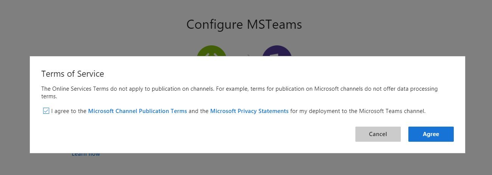

1. You will be returned to the channel list where the new channel will be listed. Click the name of the channel.

    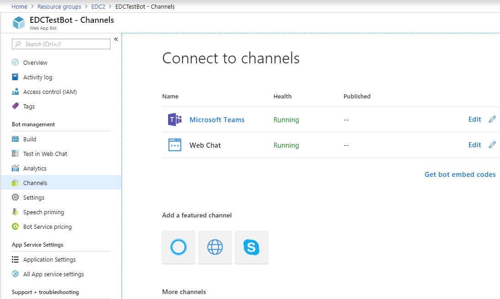

1. This will launch the bot in the teams client.

    

1. Using the `Get bot embed codes` button you can create a link that can be used by users to integrate the bot in their Teams client.

    

### Install App Studio<a name="ex6b"></a>

Microsoft Teams includes an app that helps you create your own apps. This is App Studio. You can find it in the store. App Studio will create the manifest files for your new apps including creating an app id, two steps you did manually in [HOL 2](./../HOL2). It also provides ready to use controls for your user interface. 

1. In Microsoft Teams click `Store` which can be found on the bottom left.

    

1. Use the search to find `App Studio`.

    

1. Select `App Studio` and click `Install`.

    

### Create an app manifest file<a name="ex6c"></a>

To create a manifest file that can be uploaded by the users:

1. Click `Open` next to `App`.

    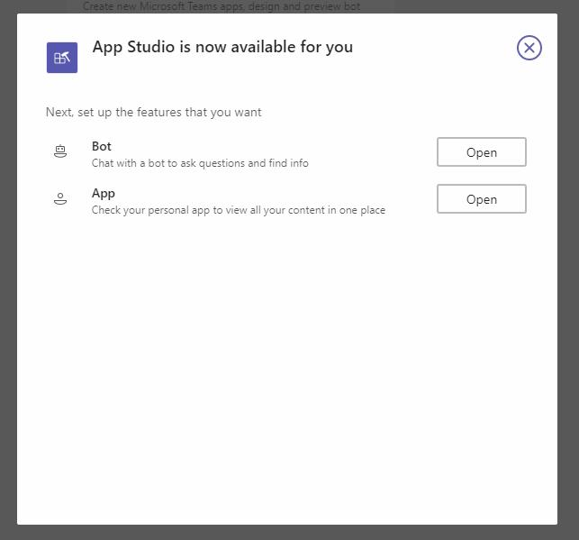

1. On the welcome screen click `Create a new app`.

    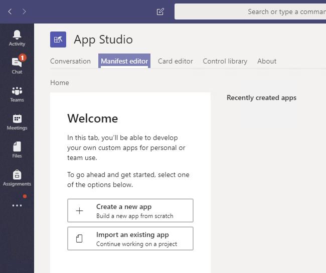

1. Provide details for all fields. Click `Generate` to generate a new App ID. Upload two icon files in the `Branding` section.

    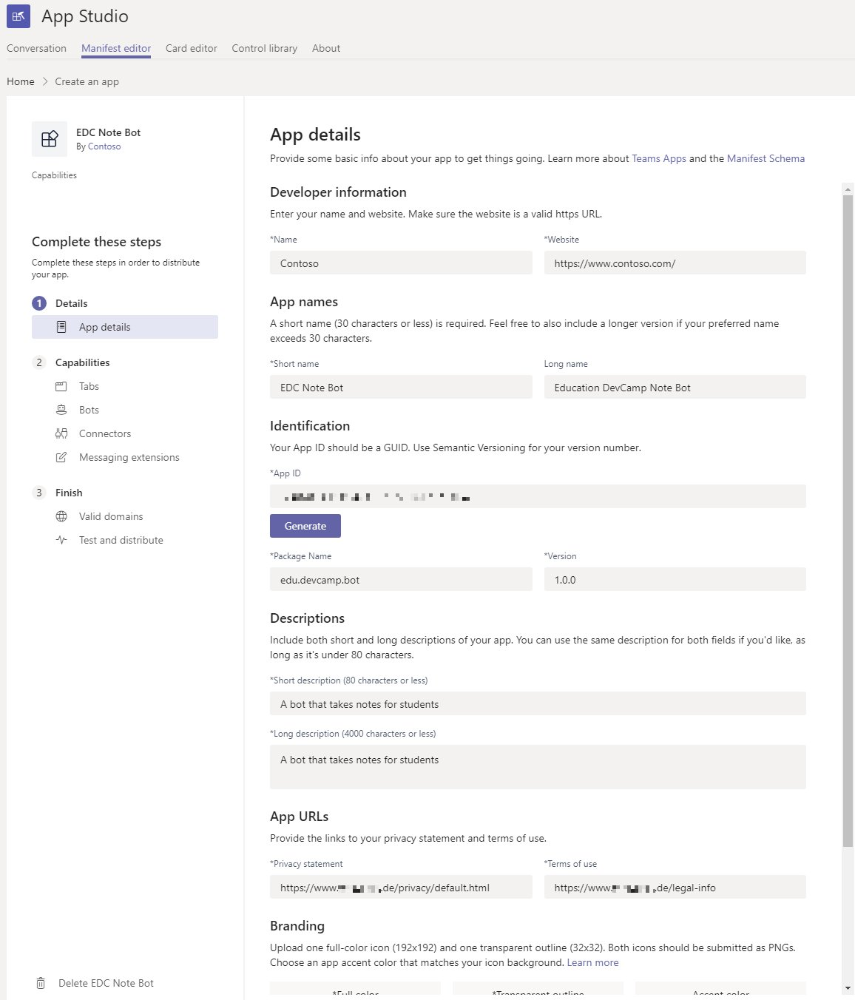

    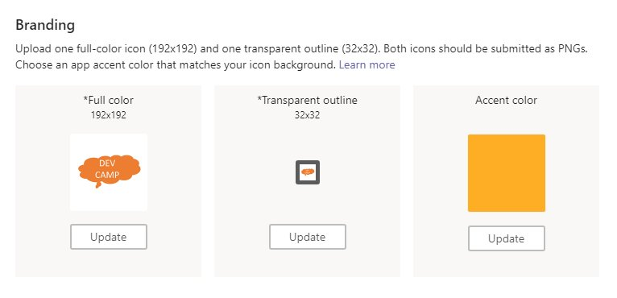

1. After you have completed the `Details` -> `App details` page click `Capabilities` -> `Bots` on the left hand menu to go to the next page. Click the `Set up` button.

    

    

    

    

### Install the bot<a name="ex6d"></a>

1. Switch user accounts.

    

    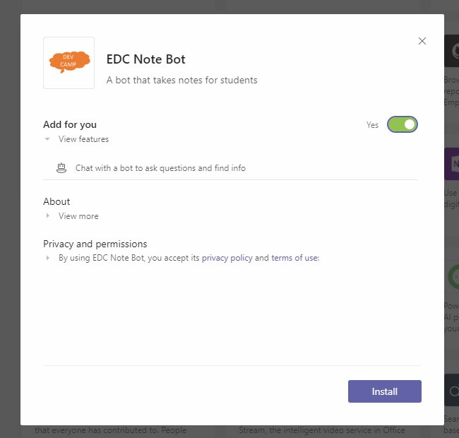

    

    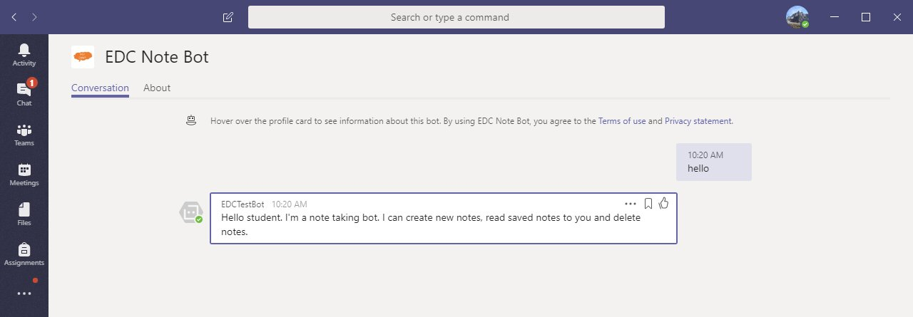
1. ... Continue through the wizard. Once you reach the end you will be able to download the manifest file.

1. ...


1. ...

[Back to top](#content)

---

## Continue with lab 7

You are now ready to start hands-on lab 7. [View HOL 7 instructions](../HOL5).

[Back to top](#content)

---

Copyright 2018 Microsoft Corporation. All rights reserved. Except where otherwise noted, these materials are licensed under the terms of the MIT License. You may use them according to the license as is most appropriate for your project. The terms of this license can be found at https://opensource.org/licenses/MIT.