# Microsoft Azure Machine Learning

## Content
* [Overview](#overview)
* [Prerequisites](#prerequisites)
* [Exercise 1: Upload the dataset](#ex1)
* [Exercise 2: Create a new experiment](#ex2)
    * [Create the predictive model](#ex2a)
    * [Improve the model](#ex2b)
* [Exercise 3: Set up a web service](#ex3)

---

## Overview
In this lab, you will set up an experiment in Microsoft Azure Machine Learning Studio which will predict class attendance.

[Back to top](#content)

---

## Prerequisites

* Complete [HOL 0](./../HOL0) to set up an Azure account.

[Back to top](#content)

---

## Exercise 1: Upload the dataset
To predict future class attendance you need to create a model which has been trained using past attendance data. This hands-on lab includes a sample data set of classes, the number of registered students and the number of attended students.

1. Open a InPrivate or Incognito browser window (`Ctrl + Shift + P` in Edge and Internet Explorer and Firefox or `Ctrl + Shift + N` in Google Chrome)
 and browse to [studio.azureml.net](https://studio.azureml.net/). Sign in and Microsoft Azure Machine Learning Studio will load. Click `DATASETS` on the menu on the left.

    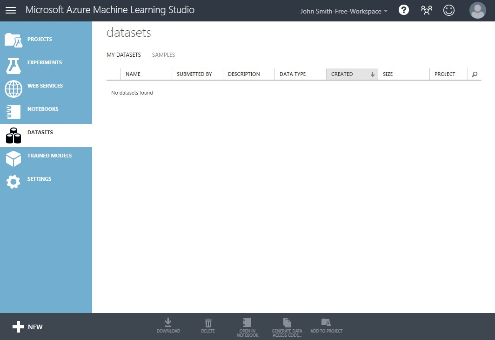

1. Click the `NEW` button in the bottom left corner. Select `FROM LOCAL FILE`.

    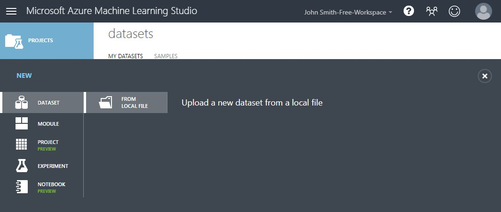

1. Download the prepared sample data [ClassAttendance.csv](./assets/ClassAttendance.csv) from the assets folder and upload it to Microsoft Azure Machine Learning Studio.

    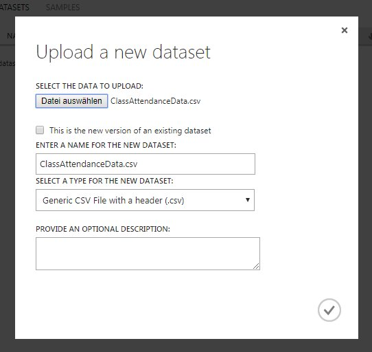

[Back to top](#content)

---

## Exercise 2: Create a new experiment

### Create the predictive model

1. On the menu on the left click `EXPERIMENTS` and then click the `NEW` button at the bottom.

    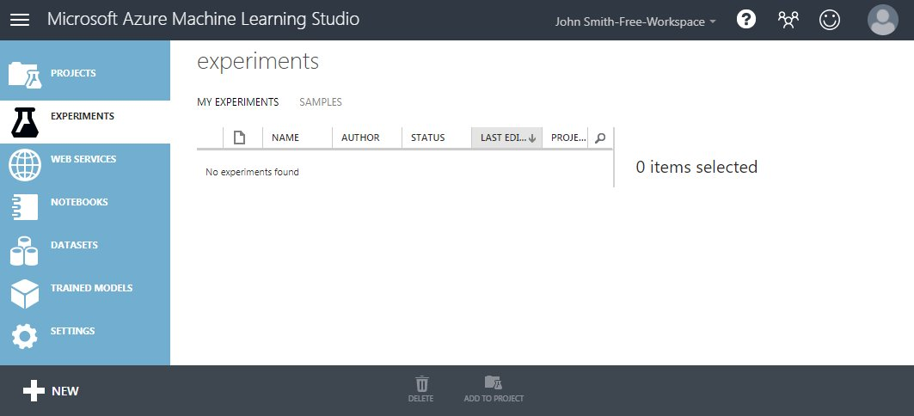

1. Select `Blank Experiment`.

    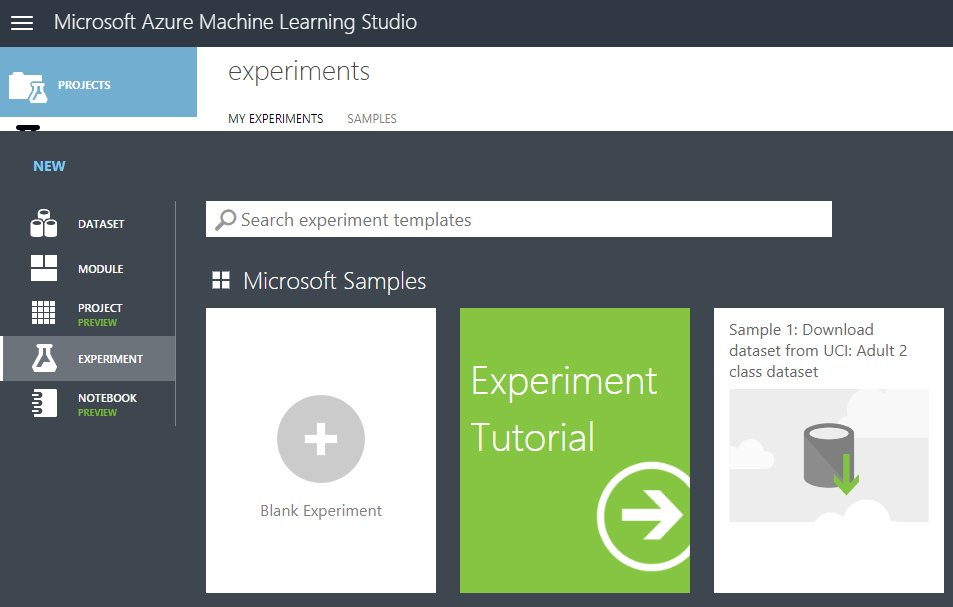

1. Open `Saved Datasets` -> `My Datasets`. Select the sample data you previously uploaded and drag it to the center of the screen.

    

1. Right-click the newly created node and select `Visualize`.

    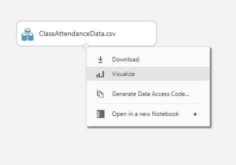

1. You can see your uploaded, unmodified data.

    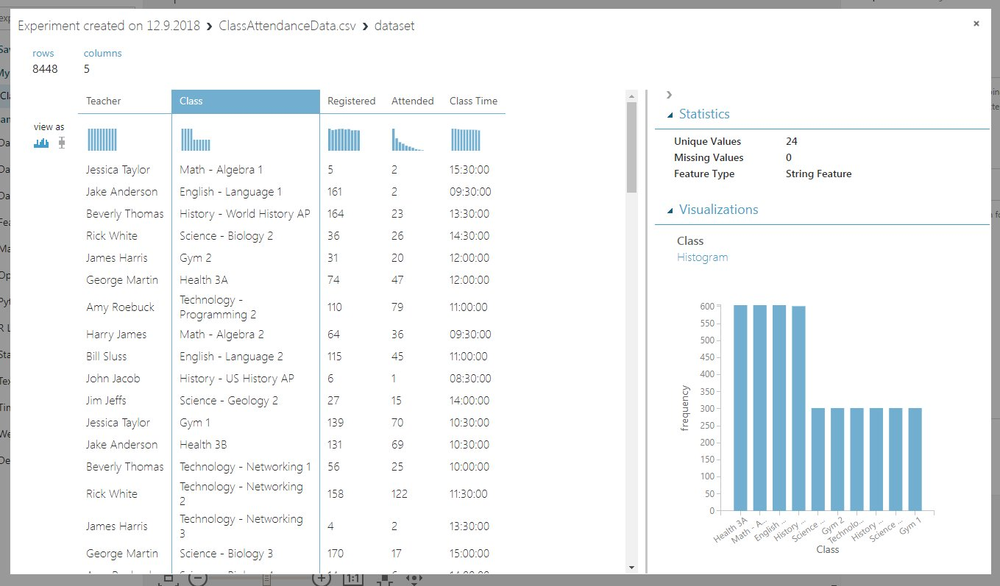

1. Open `Data Transformation` -> `Sample and Split`. Select `Split Data` and drag it to the center of the screen. Click the white circle below your data and drag a line to the top circle of `Split data`. Your data will now be used as input for the split operation. The split operation will simple split your data into two sets. You are going to use one set to train your model and the other to test it.

    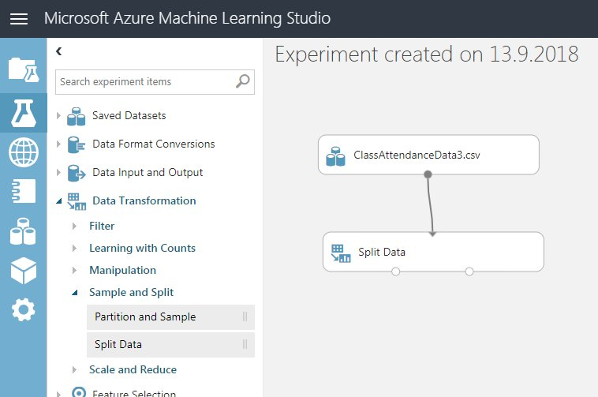

1. Set `Fraction of rows in the first output dataset` to 0.8 creating an 80% split. A random selection of 80% of your data will be available as the left output of the split operation and the other 20% will be available at the right output.

    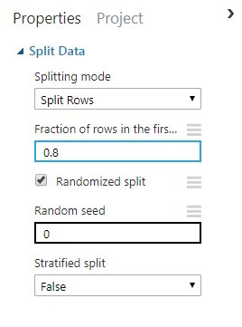

1. Open `Machine Learning` -> `Train`. Select `Train Model` and drag it to the center of the screen. Click the white circle on the left below the split operation and drag a line to the top right circle of `Train model`. This will be the input data. Now you need a training algorithm.

    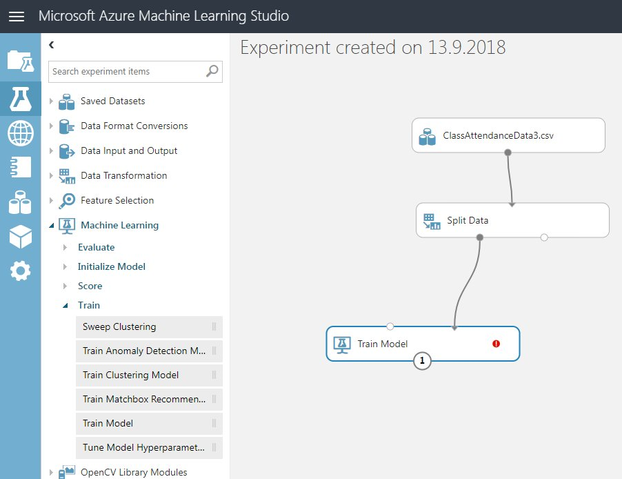

1. Open `Machine Learning` -> `Initialize Model` -> `Regression`. Select `Linear Regression` and drag it to the center of the screen. Click the white circle below the `Linear Regression` and drag a line to the top left circle of `Train Model`.

    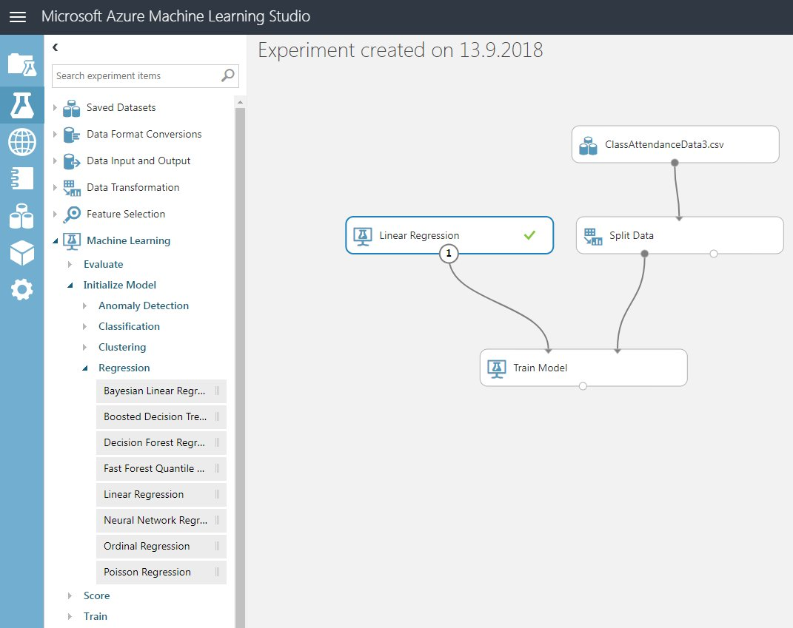

1. Click the `Train Model` to select it and go to the settings on the right side. Click `Launch column selector`. In the new window include the `Attended` column which is the column you are going to train your model to predict.

    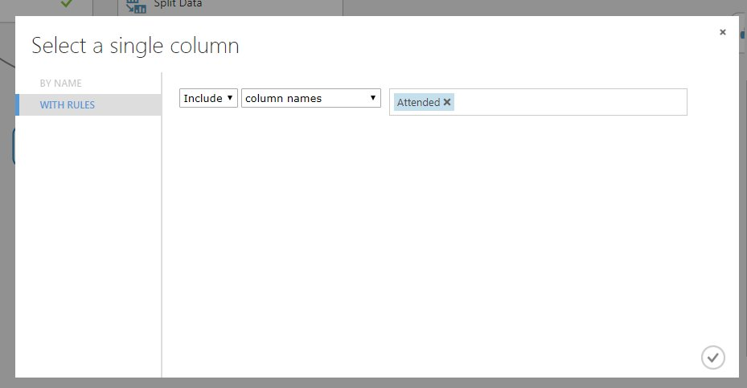

1. To see how good the training worked you need to score the trained model using the 20% of the data that was not used to train it. Open `Machine Learning` -> `Score`. Select `Score Model` and drag it to the center of the screen. Click the white circle below `Train Model` and drag a line to the top left circle of `Score Model`. Click the right circle below `Split Data` and drag a line to the top right circle of `Score Model`.

    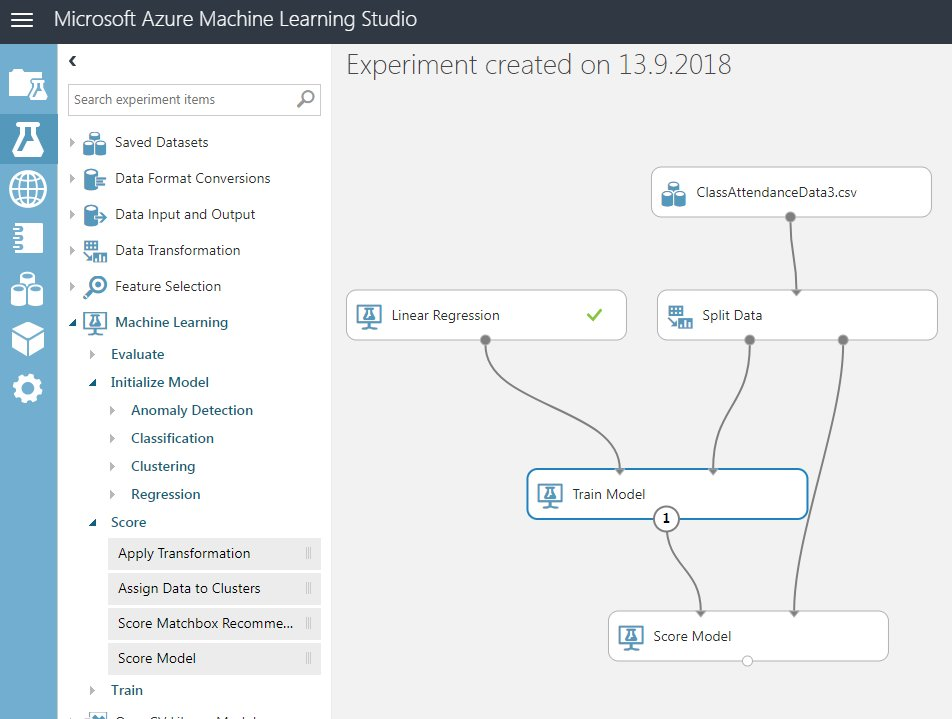

1. Open `Machine Learning` -> `Evaluate`. Select `Evaluate Model` and drag it to the center of the screen. Click the white circle below `Score Model` and drag a line to the top left circle of `Evaluate Model`.

    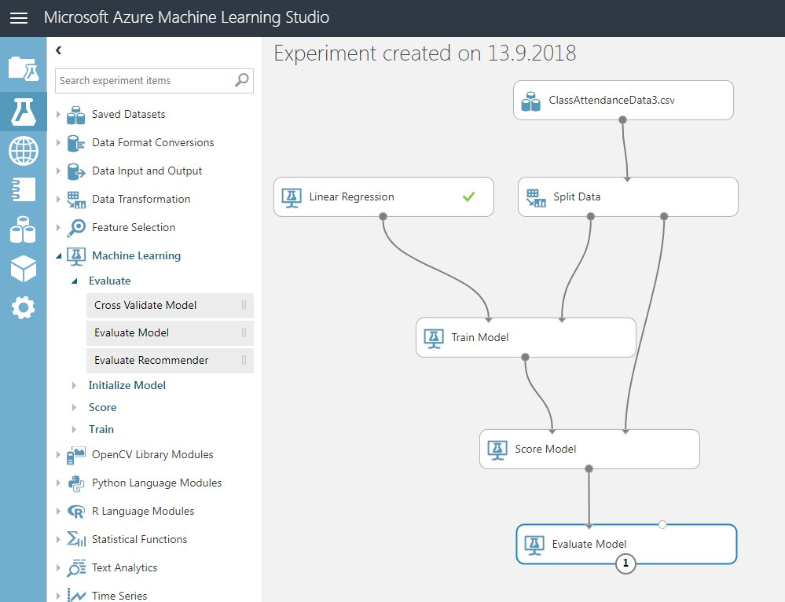

1. On the bottom menu bar press `RUN` and wait for all the steps in the experiment to finish.

    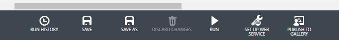

1. Right-click on the `Score Model` -> `Scored dataset` node and select `Visualize`. A new column has been added to your data of which you are now seeing the 20% that have been tested against your trained model. `Scored Labels` contains the model's prediction for the `Attended` value.

    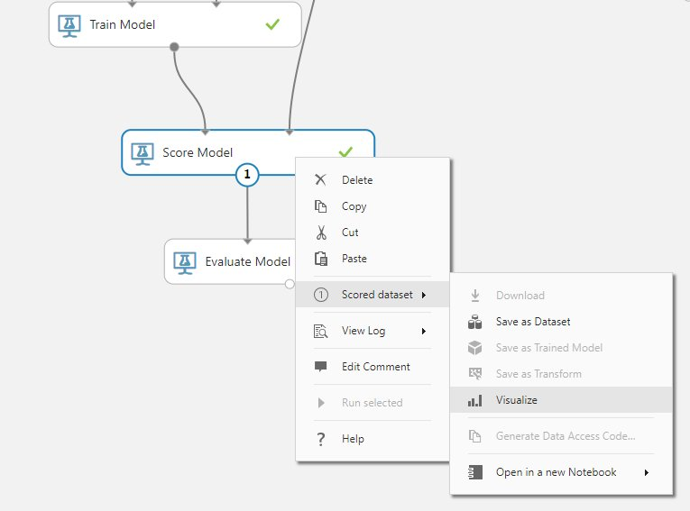

1. Select the `Attended` column and select `compare to` `Scored Labels`. This will generate a `ScatterPlot` of the real values versus the predicted values. An ideal result would be a straight line from bottom left to top right. As you can see the result is not yet perfect with some predictions even having negative values.

    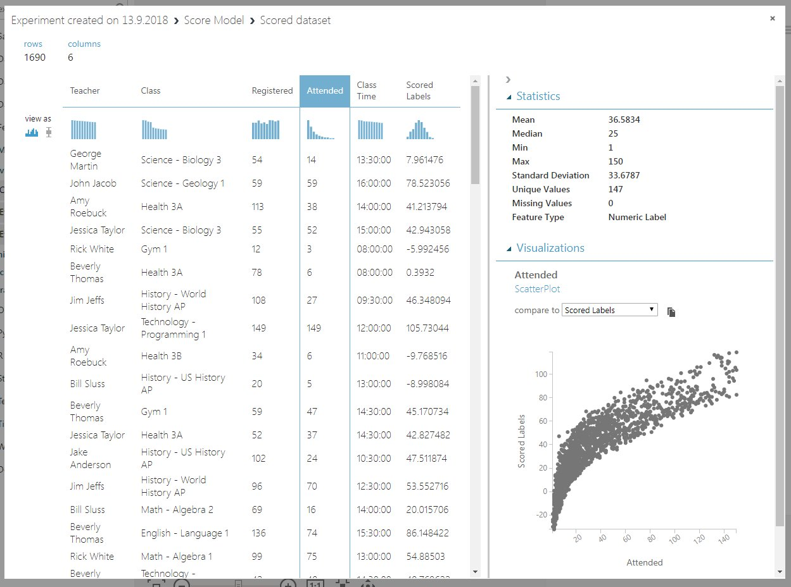

1. Close the visualization and right-click on the `Evaluate Model` -> `Evaluation results` node and select `Visualize`.

    

1. Apart from the visual representation of the prediction errors in the `ScatterPlot` before these numbers tell you how good or bad your trained model performed. When optimizing the model you want to reduce the scores of `Mean Absolute Error` and `Root Mean Squared Error`.

    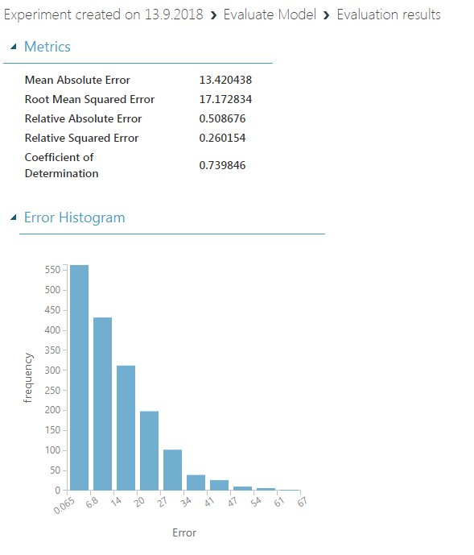

### Improve the model

To improve your predictive model you will now try a different training algorithm.

1. Open `Machine Learning` -> `Initialize Model` -> `Regression`. Select `Neural Network Regression` and drag it to the center of the screen. Remove the line between `Linear Regression` to `Train Model` by selecting it an clicking `DEL` on your keyboard. Replace it with a line from `Neural Network Regression` to `Train Model`.

    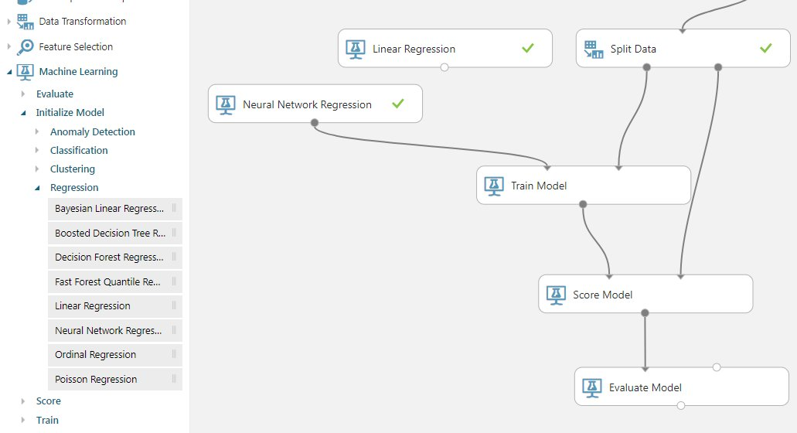

1. On the bottom menu bar press `RUN` and wait for all the steps in the experiment to finish.

1. Right-click on the `Score Model` -> `Scored dataset` node and select `Visualize`.

1. Select the `Attended` column and select `compare to` `Scored Labels`. The new `ScatterPlot` looks better than the previous one. Training the model using `Neural Network Regression` algorithm seems to have improved the result.

    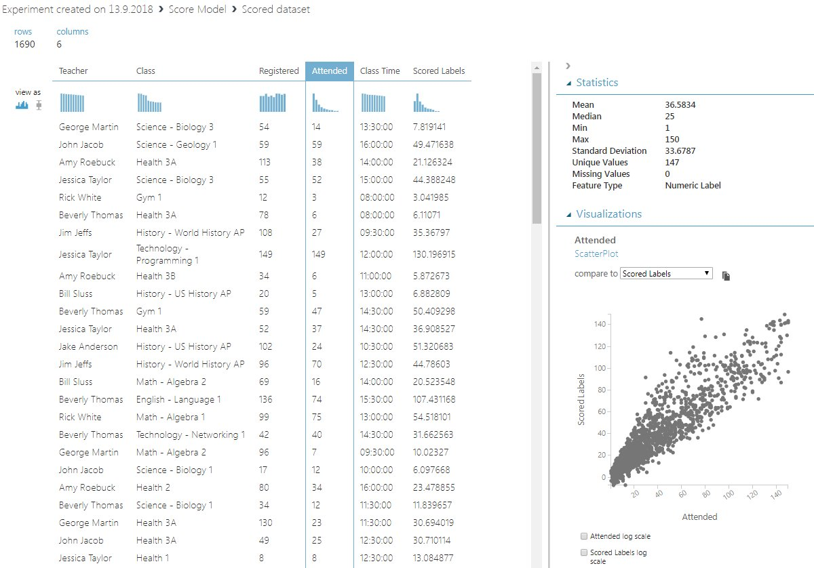

1. Close the visualization and right-click on the `Evaluate Model` -> `Evaluation results` node and select `Visualize`. The statistical data confirms that the predictive model performs better.

    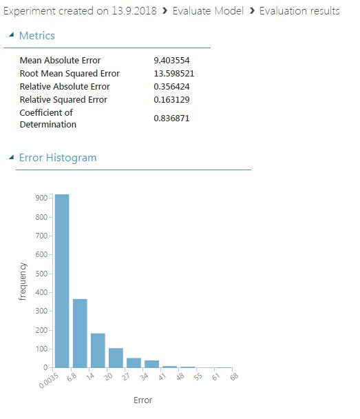

You now have an improved predictive model.

[Back to top](#content)

---

## Exercise 3: Set up a web service

Microsoft Azure Machine Learning Studio let's you set up a web service based on a trained model with just a few clicks.

1. Clean up your experiment by removing the `Linear Regression` operation and pressing `RUN` again.

    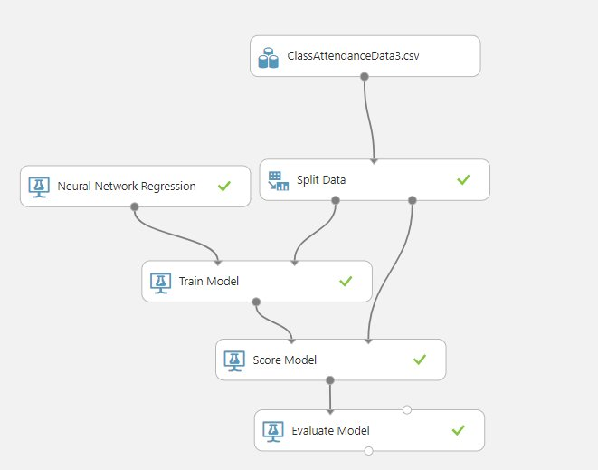

1. On the bottom menu bar press `SET UP WEB SERVICE` and select `Predictive Web Service [Recommended]`.

    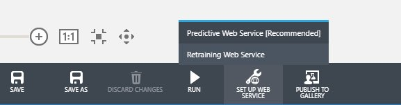

1. This will create tabs in your workspace. The first tab `Training experiment` contains the experiment you created previously and the second tab `Predictive experiment` contains the web service that has been created.

    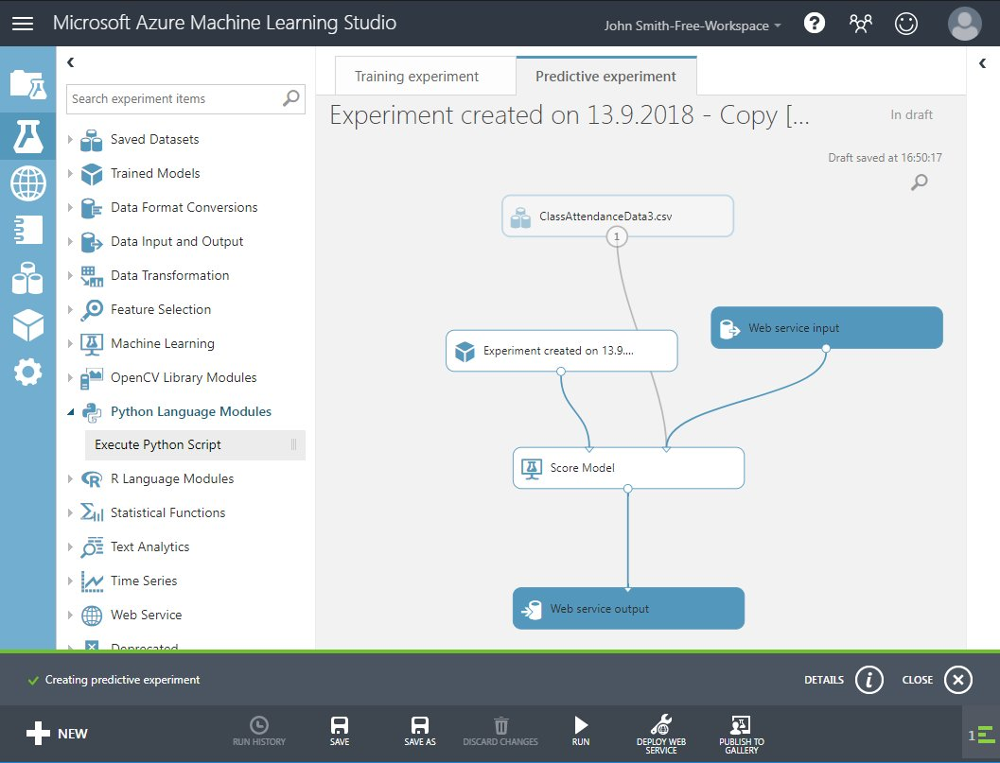

1. On the bottom menu bar press `RUN` and then `DEPLOY WEB SERVICE`.

    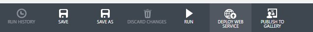

1. Once the creation of the web service has been created click the `Test` button.

    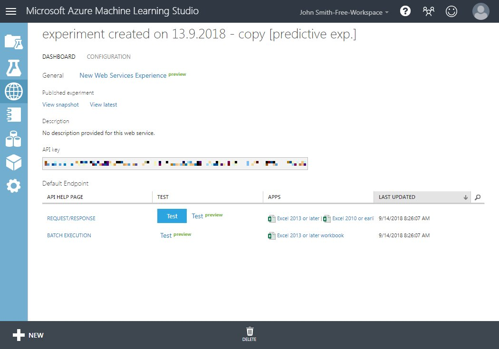

1. Enter some course data, ignore the `ATTENDED` field and click the check mark button.

    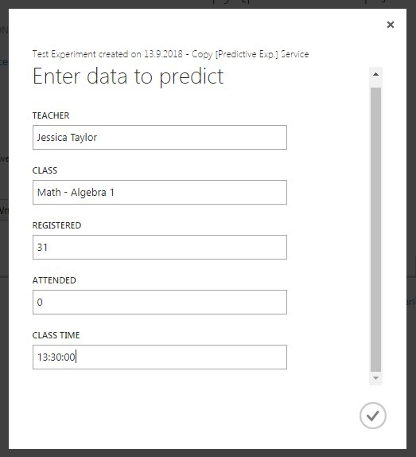

1. The result of the test will be displayed at the bottom of the screen. Click `DETAILS`.

    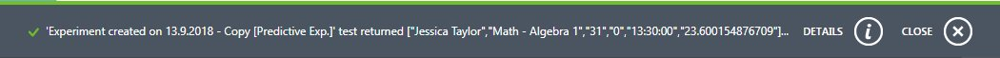

1. The last value in the displayed data is the predicted attendance.

    

1. To deploy the web service within an application click the `REQUEST/RESPONSE` link.

    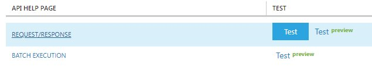

1. This will take you to a landing page specific to your web service containing an API reference and sample code on how to integrate the web service.

    

[Back to top](#content)

---

## Continue with lab 8

You are now ready to start hands-on lab 8. [View HOL 8 instructions](../HOL8).

[Back to top](#content)

---

Copyright 2018 Microsoft Corporation. All rights reserved. Except where otherwise noted, these materials are licensed under the terms of the MIT License. You may use them according to the license as is most appropriate for your project. The terms of this license can be found at https://opensource.org/licenses/MIT.